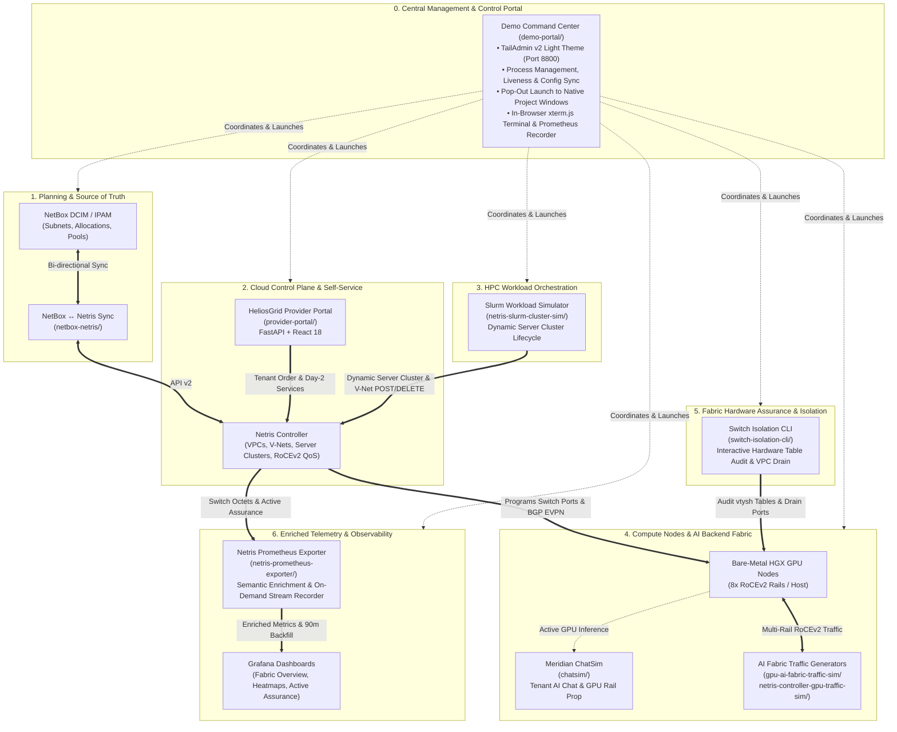
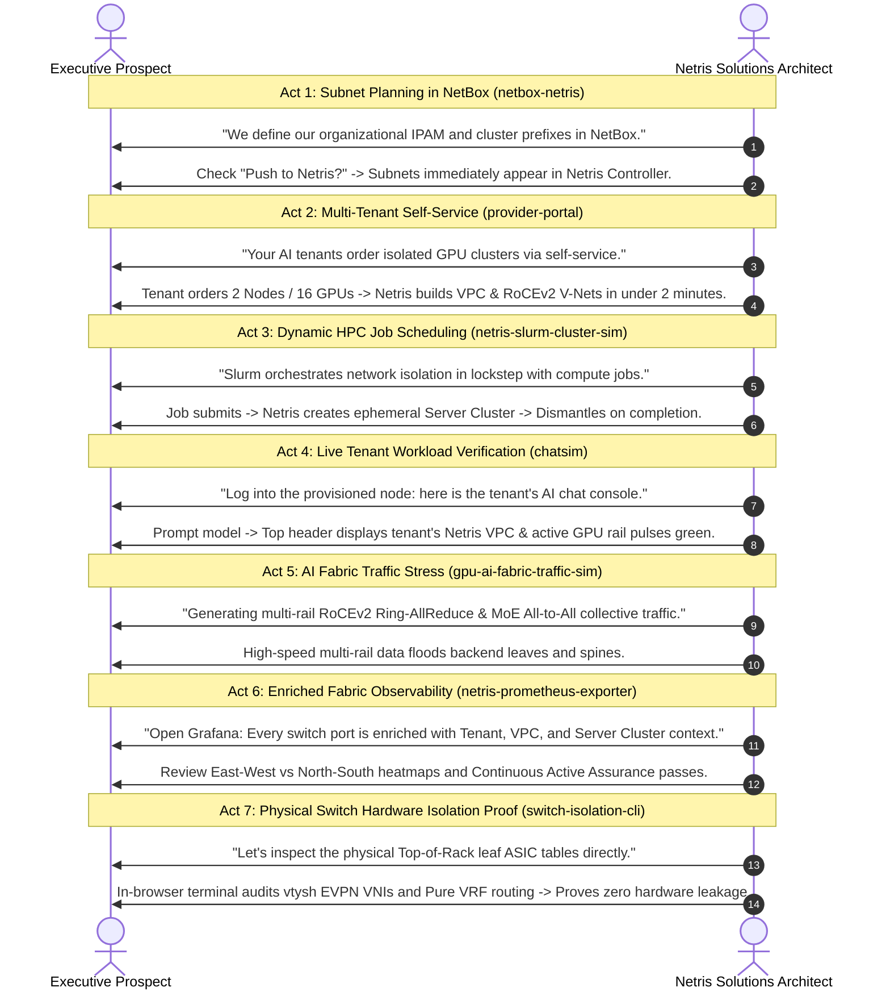

# Netris AI Cloud & Fabric Demo Toolkit

A comprehensive, production-grade demonstration and simulation suite designed for **Solutions Architects, Pre-Sales Engineers, and Technical Leaders** showcasing the full power of **Netris Cloud Networking** across modern AI GigaFactories and NeoCloud GPU environments.

This repository unites telemetry generation, multi-rail RoCEv2 traffic simulation, dynamic Slurm HPC orchestration, IPAM synchronization, customer self-service portals, physical switch hardware isolation audits, and in-cluster workload props into a single, cohesive ecosystem.

---

## 1. Master Architecture & Integration Flow



---

## 2. Toolkit Navigation & Capability Matrix

Each tool resides in its own dedicated, self-contained subfolder with an independent README, configuration template, and launch scripts:

| Tool Directory | Category | Target Audience | Primary Capability | Quick Launch |
|---|---|---|---|---|
| [`demo-portal/`](demo-portal/README.md) | **Management & Control** | Solutions Architects, SEs | **Centralized Control Portal** (TailAdmin v2 light theme) to start, stop, monitor, configure shared Netris credentials, and pop out all demo tools in their own windows. | `./demo-portal/start.sh` |
| [`gpu-ai-fabric-traffic-sim/`](gpu-ai-fabric-traffic-sim/README.md) | Cluster Traffic Sim | Network Architects, Performance Engineers | Containerized multi-rail RoCEv2 iPerf3 traffic generator simulating Ring-AllReduce, MoE All-to-All, and Incast with DSCP priority tagging across mock GPU nodes. | `docker compose up -d` |
| [`netris-controller-gpu-traffic-sim/`](netris-controller-gpu-traffic-sim/README.md) | Hardware Traffic Sim | NeoCloud Operators, Data Center Teams | Controller-hosted pre-sales automation that discovers VPC GPU hosts from Netris DB, pushes offline native iPerf3 packages over SSH, and injects continuous RoCEv2 traffic across physical leaf/spine switches. | `./deploy.sh` |
| [`netris-prometheus-exporter/`](netris-prometheus-exporter/README.md) | Telemetry & Observability | DevOps, SREs, NOC Operators | Prometheus exporter with semantic port/tenant enrichment, 90-minute historical TSDB pre-population, and turnkey Grafana dashboards. Operates live or 100% offline. | `./start.sh --sim` |
| [`netris-slurm-cluster-sim/`](netris-slurm-cluster-sim/README.md) | Slurm Sim & HPC Orchestration | HPC Engineers, Platform Architects | Autonomous Slurm workload manager simulating dynamic Netris Server Cluster provisioning, RoCEv2 East-West V-Net lifecycle, real-time web dashboard, and terminal TUI. | `python3 run_simulation.py --sim-mode` |
| [`netbox-netris/`](netbox-netris/README.md) | IPAM & DCIM Sync | Network Engineers, NetOps | Bi-directional synchronization between NetBox (IPAM source of truth) and Netris Controller, mirroring live assignments and auto-provisioning subnets. | `./start-netbox-integration.sh` |
| [`provider-portal/`](provider-portal/README.md) | Demo Portal & Self-Service | NeoCloud Executives, Cloud Architects | Full-stack multi-tenant AI Cloud self-service portal (FastAPI + React) demonstrating on-demand GPU cluster environment provisioning and an operator management console (`/ops`). | `uvicorn app.main:app --port 8000` |
| [`chatsim/`](chatsim/README.md) | Tenant Workload Demo | Business Executives, End Customers | Push-deployed AI chat assistant prop running on GPU nodes, reflecting real tenant identity, Netris VPC context, and active GPU rail utilization (`nvidia-smi`). | `python3 server.py` |
| [`switch-isolation-cli/`](switch-isolation-cli/README.md) | **Fabric Assurance & Isolation** | Solutions Architects, Security Teams | Interactive terminal utility inspecting live Top-of-Rack leaf switch hardware tables (EVPN/VXLAN & Pure VRF) to indisputably prove multi-tenant ASIC isolation and dynamic VPC draining. | `./run.sh` |

---

## 3. The 7-Act "End-to-End AI Cloud" Demo Journey

For an executive pre-sales presentation, follow this seamless narrative demonstrating the entire lifecycle of an AI Cloud powered by Netris:



---

## 4. Repository Structure

```
netris-demo-tools/
├── README.md                               # Master repository documentation (this file)
├── .gitignore                              # Unified Git hygiene rules
│
├── gpu-ai-fabric-traffic-sim/              # Containerized multi-rail RoCEv2 iPerf3 traffic generator
│   ├── Dockerfile
│   ├── docker-compose.yml
│   ├── simulate.py                         # Collective traffic engine (Ring-AllReduce, MoE, Incast)
│   └── README.md
│
├── netris-controller-gpu-traffic-sim/      # Netris Controller bare-metal GPU fabric runner
│   ├── discover_and_deploy.py              # VPC-to-GPU discovery & offline package distribution
│   ├── run_fabric_traffic.py               # Continuous collective traffic runner
│   └── README.md
│
├── netris-prometheus-exporter/             # Netris Prometheus exporter & Grafana observability
│   ├── exporter.py                         # Prometheus metrics collector
│   ├── enricher.py                         # Semantic Netris metadata enrichment engine
│   ├── sim_client.py                       # 100% offline simulation client
│   ├── backfill.py                         # Instant 90-minute TSDB historical pre-populator
│   ├── start.sh / stop.sh                  # One-click stack launchers
│   ├── grafana/ & prometheus/              # Pre-configured Grafana dashboards & Prometheus configs
│   ├── sim_data/                           # Compressed offline telemetry dataset (.json.gz)
│   └── README.md
│
├── netris-slurm-cluster-sim/               # Slurm HPC workload manager & Server Cluster orchestrator
│   ├── slurm_orchestrator.py               # Simulation engine with continuous autopilot
│   ├── netris_api.py                       # Netris Controller REST API client
│   ├── web_dashboard.py                    # Real-time web UI server
│   ├── terminal_tui.py                     # Console ANSI TUI dashboard
│   ├── run_simulation.py                   # Master entrypoint
│   └── README.md
│
├── netbox-netris/                          # NetBox IPAM ↔ Netris bi-directional synchronization
│   ├── start-netbox-integration.sh         # Docker Compose launcher
│   ├── docker-compose.yml                  # NetBox, Postgres, Valkey, and Sync Service
│   ├── sync-service/                       # Python synchronization service
│   ├── docs/                               # D2 and PNG architecture diagrams
│   └── README.md
│
├── provider-portal/                        # HeliosGrid multi-tenant AI Cloud provider portal
│   ├── app/                                # FastAPI backend, Netris client, state machine, /ops
│   ├── frontend/                           # React 18 Vite source code
│   ├── static/                             # Pre-compiled production UI bundle
│   ├── requirements.txt
│   └── README.md
├── demo-portal/                            # Centralized management portal & control plane (Port 8800)
│   ├── app/                                # FastAPI backend, process manager, config sync
│   ├── static/                             # TailAdmin v2 React light-theme UI bundle
│   ├── start.sh                            # One-click launcher (http://localhost:8800)
│   └── README.md
│
├── switch-isolation-cli/                   # Physical switch hardware table audit & VPC isolation tool
│   ├── isolation_tool.py                   # Multi-stage interactive CLI suite (EVPN/VRF)
│   ├── isolation_cli.py                    # Standalone interactive audit runner
│   ├── switch_inspector.py                 # vtysh SSH jump-host table extractor
│   ├── ping_orchestrator.py                # Inter-tenant and cross-rail ping prober
│   ├── run.sh                              # Launcher script with auto-venv setup
│   ├── config.example.json                 # Target Netris & jump-host credentials
│   └── README.md
│
└── chatsim/                                # Meridian Console AI chat & GPU rail demo prop
    ├── server.py                           # Flask server
    ├── meridian/                           # Context loader and GPU discovery
    ├── deploy_tools/                       # Push-deploy scripts for air-gapped compute nodes
    ├── static/                             # Chat UI assets
    └── README.md
```

---

## 5. Global Prerequisites & Common Setup

### System Requirements
- **macOS or Linux** (Ubuntu 22.04+ recommended for controller and host deployments).
- **Docker & Docker Compose** (v2 plugin) for containerized stacks (`netbox-netris`, `netris-prometheus-exporter`, `gpu-ai-fabric-traffic-sim`).
- **Python 3.10+** with standard tools (`python3 -m venv`, `pip`).

### Quick Tool Launch Cheatsheet

```bash
# 0. Launch the Unified Demo Command Center (Port 8800):
cd demo-portal && ./start.sh

# Or launch tools individually:
# 1. Launch Prometheus & Grafana with 90-min pre-populated demo data:
cd netris-prometheus-exporter && ./start.sh --sim

# 2. Launch Slurm HPC Orchestrator Web Dashboard (offline simulation):
cd netris-slurm-cluster-sim && python3 run_simulation.py --sim-mode --port 8088

# 3. Launch HeliosGrid Provider Portal:
cd provider-portal && uvicorn app.main:app --port 8000 --reload

# 4. Launch NetBox IPAM Sync Stack:
cd netbox-netris && ./start-netbox-integration.sh

# 5. Launch Local Meridian ChatSim Console:
cd chatsim && python3 server.py

# 6. Launch Switch Isolation & Hardware Table Assurance CLI:
cd switch-isolation-cli && ./run.sh
```

---

## 6. Git Hygiene & Contributing

- **Zero Heavy Runtime Assets in Git**: All Python virtual environments (`.venv/`), Node dependencies (`node_modules/`), Docker volumes, and SQLite runtime journals are strictly ignored via `.gitignore`.
- **Large Dataset Handling**: The offline simulation dataset (`sim_data/telemetry_recording.json.gz`) is compressed down to **5.5 MB** (from 233 MB uncompressed) and loads transparently, ensuring the repository clones and pushes cleanly under GitHub's 100 MB file limit.
- **Brand & Terminology Standards**: All documentation adheres to official Netris terminology (`Netris Controller`, `Netris VPC`, `SoftGate`, `V-Net`, `L2VPN`, `L3VPN`, `SU (Scalable Unit)`).
