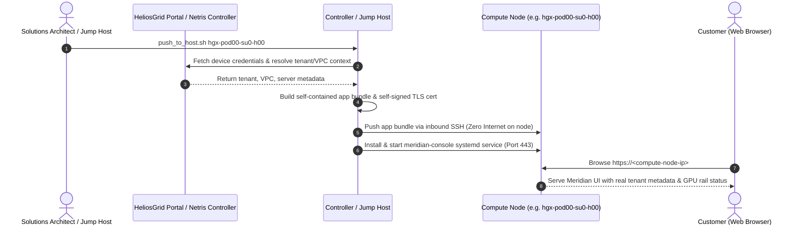

# Meridian Console: In-Cluster AI Chat & GPU Rail Workload Demo

A lightweight, self-hosted **AI Chat Assistant demo prop** engineered specifically for live GPU cloud and NeoCloud customer demonstrations.

While it appears and responds like a modern ChatGPT or Claude assistant (with realistic thinking states, chat history, and suggested prompts), every response is synthetic. Its critical value in a pre-sales demonstration is that it runs **directly inside customer GPU nodes**, dynamically binding to **real Netris VPC tenant metadata** and displaying live GPU rail activity (`nvidia-smi`) on the host.

---

## 1. Overview & Business Value

When demonstrating high-performance AI clouds to infrastructure leaders, showing abstract network switch CLI outputs or empty compute nodes often fails to convey operational reality. Customers need to see:
- What end-users experience once their GPU environment is provisioned.
- Tangible proof that compute nodes are assigned to the correct tenant and Netris VPC.
- Visible GPU activity indicating active model inference without burning high compute costs.

### Key Capabilities
- **Real Tenant & VPC Context**: Displays the exact tenant name, environment UUID, and host details resolved directly from the Netris Controller.
- **Active GPU Rail Highlighting**: Interrogates local `nvidia-smi` to display available GPU rails (e.g. 8x NVIDIA H100s/B200s), dynamically highlighting which physical GPU serves each turn.
- **100% Air-Gapped Compute Compatibility**: AI compute nodes typically have zero outbound internet connectivity and no package managers. Meridian Console is compiled on the jump host and push-deployed over trusted inbound SSH.

---

## 2. Architecture & Deployment Flow



### Component Breakdown
- `server.py`: Lightweight Flask daemon binding to `0.0.0.0`, serving the static UI and `GET /api/context`.
- `meridian/context.py`: Serves baked tenant context; queries local `nvidia-smi` without requiring outbound network reachability.
- `meridian/gpu_detect.py`: Resilient GPU discovery querying `nvidia-smi` with fallback to simulated rails on laptops.
- `deploy_tools/push_to_host.sh`: Push-deploy script run from the trusted jump host / Netris Controller.
- `deploy_tools/resolve_context.py`: Interrogates live Netris Controller to map host to its active VPC and Server Cluster.

---

## 3. Prerequisites & Requirements

- **Deployment Host (Jump Host / Netris Controller)**:
  - Linux or macOS with outbound Internet access and Python 3.
  - SSH access to compute nodes (e.g. via `~/.ssh/config` or shell aliases like `hgx-*`).
- **Compute Node Target**:
  - Python 3 standard library and `openssl`.
  - Systemd service manager.
  - Zero internet access required on the compute node.
- **Local Laptop Testing**:
  - Python 3.10+ (runs in standalone demo mode with simulated GPUs).

---

## 4. Quickstart / How to Use

### Option A: Push-Deploy to Live GPU Node (From Netris Controller / Jump Host)
```bash
# Push to compute host resolving context from HeliosGrid Portal
bash deploy_tools/push_to_host.sh hgx-pod00-su0-h00 https://your-portal.example.com

# Or push using standalone Netris credentials (without Portal)
NETRIS_BASE_URL=https://adam-ctl.netris.io \
NETRIS_USERNAME=netris \
NETRIS_PASSWORD=yourpassword \
TENANT_DISPLAY_NAME="Meridian AI" \
GPUS_PER_SERVER=8 \
  bash deploy_tools/push_to_host.sh hgx-pod00-su0-h00
```
Once deployed, open `https://<node-ip>` in your browser (accept the self-signed certificate warning).

### Option B: Local Laptop Development / Offline Demo
```bash
cd chatsim
python3 -m venv .venv
source .venv/bin/activate
pip install -r requirements.txt
python3 server.py
```
Open [http://localhost:8765](http://localhost:8765) in your browser. When running locally without a baked context, it automatically provides a mock tenant environment with 8 simulated GPUs.

---

## 5. Configuration & Environment Variables

| Variable | Scope | Default | Description |
|---|---|---|---|
| `MERIDIAN_PORT` | Runtime | `8765` (local) / `443` (host) | HTTP/HTTPS port for the console daemon. |
| `MERIDIAN_CONTEXT` | Runtime | `/etc/meridian-console/context.json` | Path to JSON file containing tenant, VPC, and server metadata. |
| `MERIDIAN_TLS_CERT` | Runtime | *None* | Path to SSL certificate for HTTPS termination. |
| `MERIDIAN_TLS_KEY` | Runtime | *None* | Path to SSL private key. |
| `OPERATOR_USERNAME` | Deployment | *Prompted* | HeliosGrid operator username for credential resolution. |
| `OPERATOR_PASSWORD` | Deployment | *Prompted* | HeliosGrid operator password for credential resolution. |

---

## 6. Demo Scenarios & Walkthrough

1. **The "Live Customer Proof" Act**:
   - Provision a tenant environment in the HeliosGrid Provider Portal.
   - Run `push_to_host.sh` to push Meridian Console to the node.
   - Open `https://<node-ip>` in front of the customer.
   - Point out the top header bar showing **their company name**, their assigned **Netris VPC**, and active **HGX node hostname**.
2. **GPU Rail Activity**:
   - Click a suggested prompt (e.g. *"Summarize our quarterly financial model"*).
   - Observe the 1-2 second "Thinking..." animation.
   - Point to the GPU rail indicator in the top right: note how GPU 3 (or another rail) pulses green during inference and reports active compute allocation.

---

## 7. Verification & Troubleshooting

### Diagnostic Checks
```bash
# Check service status on target compute node
systemctl status meridian-console

# Inspect systemd logs
journalctl -u meridian-console -f

# Uninstall and clean up host
bash deploy_tools/uninstall_host.sh hgx-pod00-su0-h00
```

### Common Issues
- **Browser Certificate Warning**: Expected when using self-signed certs generated at push time. Click *Advanced* -> *Proceed to host*.
- **GPU Rails Showing Simulated**: Ensure `nvidia-smi` is installed and accessible in the system PATH on the target host.
