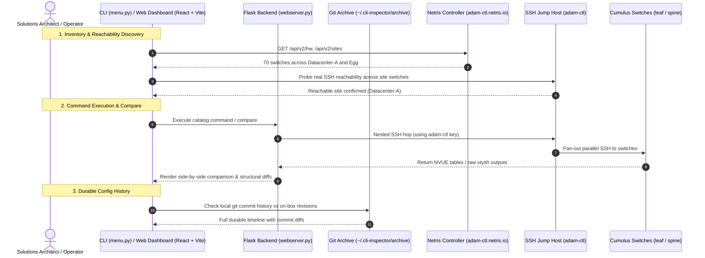

> **[WARNING] Demonstration Code Only**
> This repository contains unsupported demonstration code for architectural illustration. It is a **possible implementation pattern**, not an official Netris product or supported tool. Use at your own risk.


# Cumulus Switch CLI Inspector & Config History Suite

A production-grade, interactive CLI utility and modern web dashboard engineered for **Solutions Architects, Network Engineers, and DevOps Operators** exploring and auditing NVIDIA Cumulus Linux switches operating behind the Netris Controller and jump host infrastructure.

This suite provides unified read-only switch exploration, parallel command execution, structural side-by-side switch comparison, durable git-backed configuration revision archiving, and live multi-tenant switch isolation verification.

---

## 1. Overview & Business Value

In modern automated AI fabrics powered by Netris and NVIDIA Cumulus Linux (NVUE), platform engineers face several visibility challenges:
- **On-Box Garbage Collection**: Cumulus Linux's native `nv config history` retains only a small rolling window of recent revisions before automatically pruning them (`Unknown revision`). This tool introduces a durable local git-backed archive that preserves full configuration histories indefinitely.
- **Side-by-Side Switch Comparisons**: Rapidly identify configuration drift or ASIC table discrepancies between two leaf switches (e.g. `leaf-0` vs `leaf-1`) using structural JSON and colored unified diffs.
- **Command Catalog**: Verified, curated command set covering NVUE operational tables (`show system`, `show interface`, `show vrf`, `show evpn`) and low-level `vtysh` state.
- **Real-Time Watch Mode**: Continuously monitor the fabric for Netris Controller API writes and on-box switch configuration changes. Instantly identifies affected switches vs unchanged switches and displays newly added (+) and removed (-) configuration lines per device in both CLI and Web UI.
- **Fabric Isolation & Assurance**: Live hardware table audits proving multi-tenant EVPN VNI separation and pure VRF FIB partitioning, backed by in-cluster ping tests.

---

> **[WARNING] Demonstration Code Only**
> This repository contains unsupported demonstration code for architectural illustration. It is a **possible implementation pattern**, not an official Netris product or supported tool. Use at your own risk.


## 2. Architecture & Data Flow



---

## 3. Prerequisites & Requirements

- **Python**: Python 3.10 or higher.
- **Node.js**: Node 18+ (for building/running the webapp dashboard).
- **Network Reachability**:
  - Netris Controller API access (e.g. `https://adam-ctl.netris.io`).
  - SSH access to the jump host (e.g. `ubuntu@adam-ctl.netris.io`).
  - Switches accessible from the jump host with key-based authentication.

---

> **[WARNING] Demonstration Code Only**
> This repository contains unsupported demonstration code for architectural illustration. It is a **possible implementation pattern**, not an official Netris product or supported tool. Use at your own risk.


## 4. Quickstart / How to Run

### Option A: Launch from the Demo Control Portal
1. Open the **Demo Command Center** at [http://localhost:8800](http://localhost:8800).
2. Locate the **Cumulus Switch CLI Inspector** card.
3. Click **"Launch CLI"** (to open an in-browser xterm.js terminal session) or **"iTerm ↗"** (to open natively in iTerm2), or **"Web Dashboard ↗"** to launch the browser UI.

### Option B: Interactive Terminal CLI
```bash
cd cli-inspector
./run.sh
```
*(Select **"Watch mode (live config monitor & diff reviewer)"** from the main menu or within **"Config history & snapshots"**).*

### Option C: Standalone Watch Mode Daemon
```bash
cd cli-inspector
.venv/bin/python watch.py --site Datacenter-A --poll 10
```
*(Continuously monitors Netris Controller writes and switch NVUE configs, alerting on product activity, pinpointing affected switches, and displaying per-switch added `+` and removed `-` configuration commands).*

### Option D: Web Dashboard (React + Flask)
```bash
# Terminal 1: Backend API (Port 8743)
cd cli-inspector
./start_web.sh

# Terminal 2: Frontend (Port 5173)
cd cli-inspector/webapp
npm install && npm run dev
```
Open **`http://localhost:5173`** in your browser.

---

## 5. Configuration & Shared Credential Sync

Configuration is managed via [`config.json`](file:///Users/adam/.gemini/antigravity/scratch/netris-demo-tools/cli-inspector/config.json):

```json
{
  "netris_url": "https://adam-ctl.netris.io",
  "netris_username": "netris",
  "netris_password": "YOUR_PASSWORD",
  "ssh_jump_host": "adam-ctl.netris.io",
  "ssh_jump_port": 22,
  "ssh_jump_user": "ubuntu",
  "ssh_switch_user": "cumulus",
  "archive_dir": "~/.cli-inspector/archive"
}
```

This file is automatically synchronized with global credentials from the **Demo Command Center** (`demo-portal`).

---

> **[WARNING] Demonstration Code Only**
> This repository contains unsupported demonstration code for architectural illustration. It is a **possible implementation pattern**, not an official Netris product or supported tool. Use at your own risk.


## 6. Pre-Sales Demo Talk Tracks

- **Talk Track 1 — Live Fabric Exploration**:
  *"Notice how we can fan out an NVUE command across all 18 leaf and spine switches simultaneously through our single jump host connection. In less than 2 seconds, we have full visibility into every active BGP session and interface state without leaving our terminal."*
- **Talk Track 2 — Eliminating Configuration Drift**:
  *"When commissioning a new compute pod, we compare `leaf-0` and `leaf-1` side-by-side. The tool performs structural JSON diffing, instantly highlighting any mismatched MTUs, missing VLANs, or disparate QoS parameters."*
- **Talk Track 3 — Hardware Multi-Tenant Assurance**:
  *"Rather than trusting high-level management checkboxes, we inspect the actual ASICs on `ns-leaf-0` and `leaf-pod00-su0-r0`. Here you can see that tenant VNI 10031 is isolated in hardware, while cross-VPC ping traffic drops with 100% loss."*

---

## 7. Verification & Troubleshooting

- **Check Connectivity**: Run `./run.sh` and select **"Settings / connectivity test"** from the main menu.
- **Egg Site Unreachable**: The tool probes real SSH reachability on startup. If a site has no active L3 route from the jump host, it is flagged as unreachable to prevent timeouts.
- **Port Conflicts**: Backend API runs on port `8743` and Vite dev server on port `5173`.
