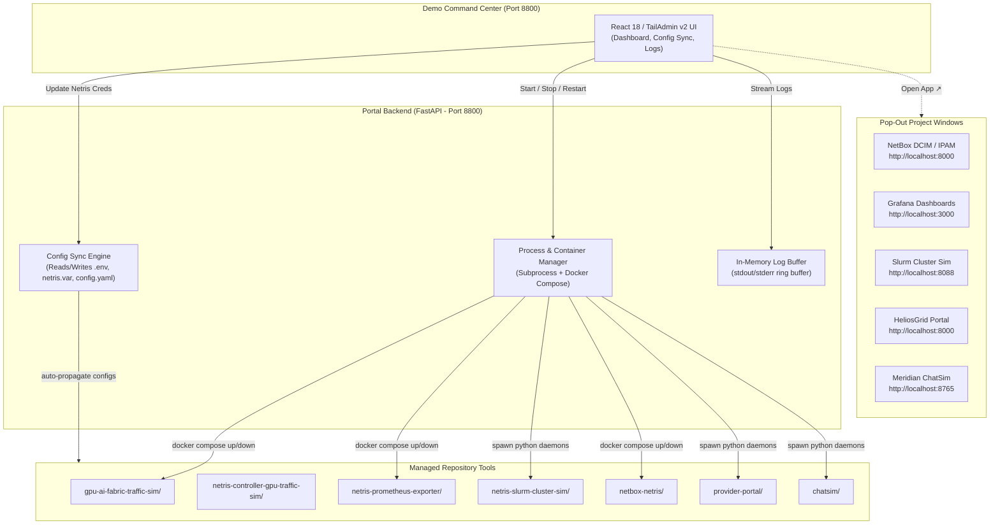

# Demo Command Center: Unified Multi-Tool Control Portal

A centralized management portal and control plane engineered to coordinate, monitor, configure, and launch the entire suite of **Netris AI Cloud & Fabric Demo Tools** from a single interface.

Built strictly in accordance with **TailAdmin v2** light-theme design principles (`common-ui-guidelines`), the Demo Command Center provides real-time health monitoring, shared credential auto-propagation, per-tool configuration editing, and one-click pop-out launching into dedicated project windows.

---

## 1. Overview & Business Value

Running an end-to-end AI Cloud demonstration traditionally requires juggling multiple terminal tabs, editing disjointed `.env` files, remembering separate port numbers (`:8000`, `:8088`, `:3000`, `:8765`), and troubleshooting port collisions.

### Key Capabilities
- **Single Control Plane (Port 8800)**: Start, stop, and restart all 7 demo tools from one unified web interface without opening separate terminals.
- **Shared Credential Auto-Propagation**: Update Netris Controller credentials (`URL`, `Username`, `Password`, `Verify SSL`, `Tenant`, `Site`) in one form; the portal automatically writes them into every tool's `.env` and configuration file across the repository.
- **Dedicated Pop-Out Project Windows**: Native tools (NetBox, Grafana, Slurm Sim, HeliosGrid, and ChatSim) pop out into their own full-featured browser windows via one-click **"Open App ↗"** buttons once deployed.
- **Real-Time Process Logs**: Slide-out live console stream with auto-refreshing stdout/stderr for troubleshooting background scripts and containers.
- **Executive Light Theme**: Clean, professional TailAdmin v2 light interface with Outfit typography, signature Coral (`#FF3366`) interactive accents, and soft drop shadows.

---

## 2. Architecture & Data Flow



---

## 3. Prerequisites & Requirements

- **Python**: Python 3.10 or higher.
- **Operating System**: macOS or Linux.
- **Docker**: Docker & Docker Compose v2 (for containerized tools).

---

## 4. Quickstart / How to Use

### Step 1: Launch the Portal
```bash
cd demo-portal
./start.sh
```
*(On first boot, this automatically creates a local `.venv`, installs dependencies, and boots the portal).*

### Step 2: Open in Browser
Navigate to:
👉 **[http://localhost:8800](http://localhost:8800)**

### Step 3: Configure Shared Credentials
1. Click **"Shared Controller Settings"** in the sidebar.
2. Enter your Netris Controller URL, credentials, default tenant, and site.
3. Click **"Save & Propagate Everywhere"**. The portal immediately pushes these values into all tool configuration files.

### Step 4: Deploy & Pop Out Tools
1. Return to the **Dashboard Hub**.
2. Click **"Start"** on any desired tool (e.g. *Slurm Dynamic Cluster Orchestrator* or *HeliosGrid Provider Portal*).
3. Once the status flips to 🟢 **RUNNING**, click **"Open App ↗"** to launch it in a dedicated project window!

---

## 5. Configuration & Shared Credential Sync

When you save settings in the **Shared Controller Settings** tab, the portal automatically updates:

| Target File | Configuration Variables Written |
|---|---|
| `netris-prometheus-exporter/netris.var` | `NETRIS_BASE_URL`, `NETRIS_USERNAME`, `NETRIS_PASSWORD`, `NETRIS_VERIFY_SSL` |
| `netris-prometheus-exporter/.env` | `NETRIS_BASE_URL`, `NETRIS_USERNAME`, `NETRIS_PASSWORD`, `NETRIS_VERIFY_SSL` |
| `netbox-netris/.env` | `NETRIS_URL`, `NETRIS_USER`, `NETRIS_PASSWORD` |
| `provider-portal/.env` | Controller endpoint credentials and operator authentication |
| `netris-slurm-cluster-sim/.env` | `NETRIS_URL`, `NETRIS_USERNAME`, `NETRIS_PASSWORD`, `DEFAULT_TENANT`, `DEFAULT_SITE` |

---

## 6. Demo Scenarios & Pop-Out Launching

### Scenario A: One-Click AI Fabric Demo
1. In the header bar, click **"Start All AI Fabric"**.
2. The portal simultaneously starts the **Slurm Cluster Simulator** (`:8088`) and the **Prometheus/Grafana Observability Stack** (`:3000`).
3. Click **"Open App ↗"** on both cards to open Slurm and Grafana in side-by-side browser windows.

### Scenario B: Clean Reset After a Meeting
1. In the header bar, click **"Stop All"**.
2. All running background scripts and Docker containers are cleanly shut down and ports are freed.

---

## 7. Verification & Troubleshooting

- **Health Endpoint**: `GET http://localhost:8800/healthz` (returns `{"status":"ok"}`).
- **Interactive API Documentation**: Explore Swagger documentation at `http://localhost:8800/docs`.
- **Port Conflicts**: If port 8800 is already in use, override it via `PORT=8899 ./start.sh`.
- **Inspecting Process Logs**: Click the terminal icon on any card or open the **"Process Logs Console"** tab to view real-time log output.
