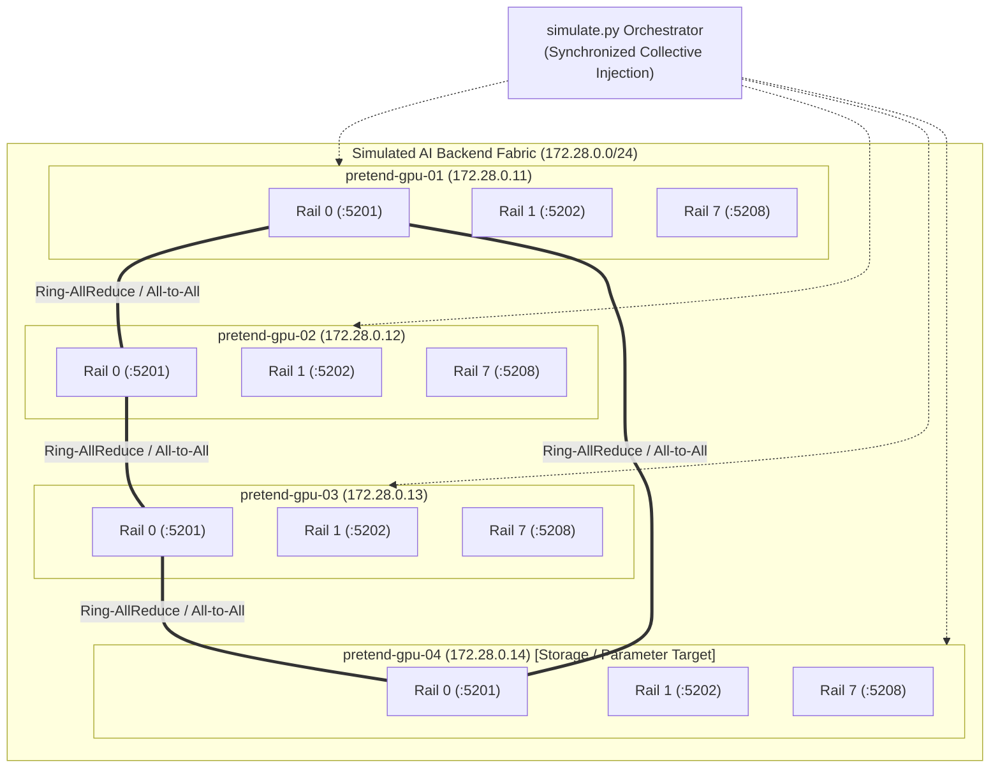
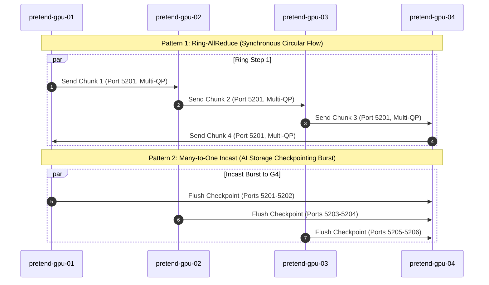

# GPU AI Fabric Traffic Simulator with iPerf3

A turnkey, containerized testbed for simulating **distributed GPU AI training and inference traffic patterns** across pretend GPU compute nodes. Built with Docker Compose, multi-rail `iperf3` daemon topologies, and a Python collective orchestration engine.

---

## 1. Executive Summary & Solution Value

In modern AI GigaFactories and NeoCloud deployments (such as clusters powered by NVIDIA HGX H100/H200/B200 or AMD Instinct MI300X servers), network fabrics must sustain multi-terabit bisection bandwidth, near-zero packet loss, and bounded microsecond tail latencies. 

Before committing hardware or running multi-node training workloads via NCCL/RCCL, network architects and pre-sales engineers need a repeatable method to:
- **Simulate Collective Communication Primitives:** Replicate how distributed training algorithms (Ring-AllReduce, All-to-All MoE, and Checkpointing Incast) stress network buffers and ECMP link hashing.
- **Model Multi-Rail Topologies:** Emulate 8-GPU nodes where each GPU has dedicated NIC rails and independent Queue Pairs (QPs).
- **Validate Lossless RoCEv2 Quality of Service:** Inject traffic tagged with DSCP values corresponding to RoCEv2 Lossless Priority 3 (TOS 96 / DSCP 24).
- **Benchmark Without Physical GPUs:** Conduct rapid pre-sales demos, automated CI/CD network validation, and educational simulations directly on any Linux or macOS environment running Docker.

---

## 2. Fabric Architecture & Node Topology



### Server & Rail Mapping

| Pretend GPU Server | IP Address | Role | Configured Ports | Emulated Hardware Equivalent |
|:---|:---|:---|:---|:---|
| `pretend-gpu-01` | `172.28.0.11` | Worker Node | `5201`–`5208` | 8x GPU HGX Server (Rail 0–7) |
| `pretend-gpu-02` | `172.28.0.12` | Worker Node | `5201`–`5208` | 8x GPU HGX Server (Rail 0–7) |
| `pretend-gpu-03` | `172.28.0.13` | Worker Node | `5201`–`5208` | 8x GPU HGX Server (Rail 0–7) |
| `pretend-gpu-04` | `172.28.0.14` | Target / Storage | `5201`–`5208` | AI Scale-Out Storage (VAST / Weka) |

Each container runs 8 independent background `iperf3` server daemons listening on ports `5201` through `5208`, allowing full-mesh parallel traffic injection without port collision.

---

## 3. Supported AI Collective Communication Patterns



### 1. Ring-AllReduce (`ring-allreduce`)
- **What it models:** Canonical NCCL/RCCL AllReduce operation used in distributed Large Language Model (LLM) training (e.g. data parallelism and tensor parallelism).
- **Traffic Profile:** Circular ring data movement: Node 1 $\to$ Node 2 $\to$ Node 3 $\to$ Node 4 $\to$ Node 1.
- **Network Stress:** Synchronized, high-throughput elephant flows across all links simultaneously. Tests sustained line-rate forwarding without buffer degradation.

### 2. All-to-All / Mixture of Experts (`all-to-all`)
- **What it models:** Mixture of Experts (MoE) token routing (e.g. Mixtral, DeepSeek) where every GPU routes tokens to specific expert weights hosted across other nodes.
- **Traffic Profile:** Full mesh ($N \times (N-1)$ flows) where every node simultaneously streams data to all peers.
- **Network Stress:** Massive bisection bandwidth stress, heavy queue hash collisions across ECMP links, and buffer micro-bursting.

### 3. Many-to-One Incast (`incast`)
- **What it models:** Synchronous model checkpointing writes to scale-out NVMe-oF/RoCEv2 storage appliances (e.g. VAST Data, Weka) or parameter server aggregation.
- **Traffic Profile:** Multiple worker nodes blast full-bandwidth streams into a single target server concurrently.
- **Network Stress:** Severe egress port oversubscription at the target. In real fabrics, this exercises PFC pause frames and ECN threshold marking to prevent buffer drops.

### 4. Multi-Rail Optimized Burst (`multi-rail`)
- **What it models:** 8-rail non-interfering GPU interconnect between servers.
- **Traffic Profile:** Node 1 Rail $i \to$ Node 2 Rail $i$ concurrently across ports `5201` to `5208`.
- **Network Stress:** Tests parallel queue-pair (QP) saturation and host PCIe/NIC parallelism.

---

## 4. Quick Start Guide

### Prerequisites
- Docker & Docker Compose
- Python 3

### Step 1: Launch the Simulator
Run the turnkey script to build the pretend GPU containers and start the environment:
```bash
./run.sh
```
By default, this provisions all four pretend GPU nodes, initializes the multi-rail listeners, and runs a 5-second Ring-AllReduce benchmark.

### Step 2: Run Specific AI Collectives

```bash
# Run Ring-AllReduce with 5-second duration and 4 parallel QPs per rail
python3 simulate.py --pattern ring-allreduce --duration 5 --streams 4

# Run Mixture of Experts (MoE) All-to-All full-mesh benchmark
python3 simulate.py --pattern all-to-all --duration 5 --streams 2

# Run Incast / Storage Checkpoint burst against pretend-gpu-04
python3 simulate.py --pattern incast --duration 5 --streams 4 --target pretend-gpu-04

# Run 8-Rail dedicated GPU interconnect benchmark
python3 simulate.py --pattern multi-rail --duration 5 --streams 4

# Run the complete test suite with JSON metrics output
python3 simulate.py --pattern all --duration 3 --json-out ./fabric_results.json
```

### Step 3: Teardown
```bash
docker compose down
```

---

## 5. CLI Command Reference

| Parameter | Type | Default | Description |
|:---|:---|:---|:---|
| `--pattern` | choice | `ring-allreduce` | `ring-allreduce`, `all-to-all`, `incast`, `multi-rail`, or `all` |
| `--duration`, `-t` | int | `5` | Test duration per collective step in seconds |
| `--streams`, `-P` | int | `4` | Number of parallel Queue Pairs / TCP streams per flow |
| `--protocol` | choice | `tcp` | Transport protocol (`tcp` or `udp`) |
| `--tos` | int | `96` | IP Type of Service / DSCP value (96 = DSCP 24 / CS3 for RoCEv2 Priority 3) |
| `--target` | string | `pretend-gpu-04` | Destination node for Many-to-One Incast test |
| `--max-bandwidth`, `-B` | string | `None` | Overall cluster aggregate bandwidth ceiling (e.g. `500M`, `1G`, `2G`) |
| `--bitrate`, `-b` | string | `None` | Per-flow bandwidth rate cap (e.g. `50M`, `100M`) |
| `--bytes-limit`, `-n` | string | `None` | Data volume limit per flow instead of time (e.g. `100M`, `500M`) |
| `--json-out` | path | `None` | Path to export raw structured JSON metrics |

---

## 6. Interpreting Results for AI Fabrics

When running simulations, focus on these pre-sales and performance indicators:

1. **Retransmissions (`Retrans/Loss`):**
   - In distributed AI training, packet loss is fatal to job performance. Even a 0.1% packet loss rate can degrade NCCL AllReduce completion times by 50–90% due to tail-latency synchronization barriers.
   - A healthy fabric achieves zero or near-zero retransmits.
2. **Aggregated Fabric Throughput:**
   - Shows the cumulative multi-rail bandwidth achieved across all simulated GPU nodes.
3. **Queue Pair (QP) Scaling:**
   - Increasing `--streams` models multi-QP RoCEv2 hashing across ECMP spines. If throughput does not scale linearly or packet loss spikes, it indicates hash polarization or buffer starvation.
