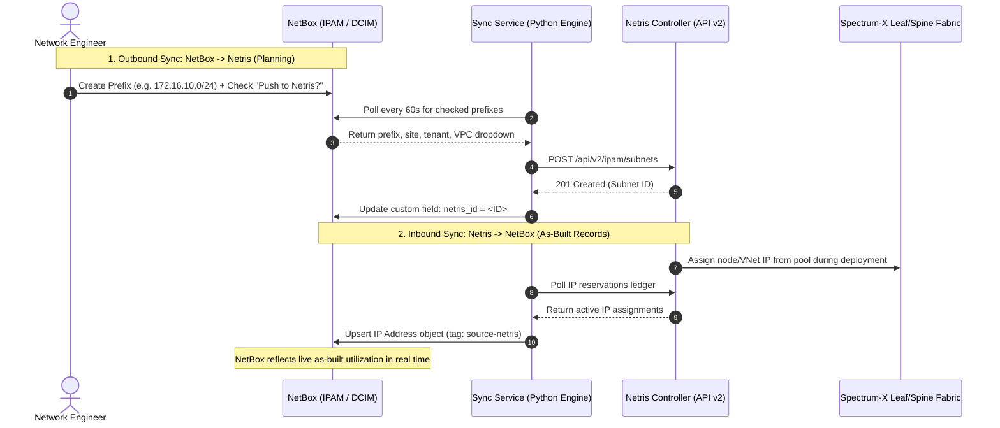

# NetBox ↔ Netris IPAM Bi-Directional Sync

A turnkey, deployable integration bridging [NetBox](https://netboxlabs.com/) (DCIM/IPAM) and the [Netris Controller](https://netris.io/), guaranteeing that IP subnet planning and live physical fabric assignments remain continuously synchronized across systems.

---

## 1. Overview & Business Value

In modern enterprise and NeoCloud environments, network architects face an operational divide:
- **NetBox** serves as the authoritative source of truth for planning IP address space, allocations, and organizational prefixes.
- **Netris Controller** acts as the authoritative source of truth for runtime fabric enforcement, dynamic VPC IP assignment, and BGP underlay addressing.

Without automated synchronization, engineers must manually duplicate subnet reservations across both systems, risking IP overlaps, configuration drift, and delayed cluster deployments.

### Netris Value Proposition & ROI
- **NetBox as Planning Source of Truth**: Network engineers plan IP aggregates and prefixes in NetBox; checking **"Push to Netris?"** automatically provisions them into Netris without human intervention.
- **Netris as Assignment Source of Truth**: As Netris dynamically allocates IPs to GPU nodes, V-Nets, and BGP sessions, those live assignments immediately flow back into NetBox as the as-built record.
- **Continuous Bi-Directional Mirroring**: Not a one-time migration. Polls both systems every 60 seconds to maintain synchronized state, supporting multiple VPCs.

---

## 2. Architecture & Data Flow



See [`docs/netbox-netris-arch.png`](docs/netbox-netris-arch.png) for the full architecture/data-flow diagram, and [`docs/netbox-netris-arch.d2`](docs/netbox-netris-arch.d2) for its editable source.

---

## 3. Quickstart & How to Run

Requires Docker with the Compose v2 plugin (`docker compose version` should work).

```bash
./start-netbox-integration.sh
```

On first run this:

1. Copies `.env.example` → `.env` if `.env` doesn't exist yet, then stops so you can
   fill in real secrets (if `.env` already exists — e.g. it was set up for you — it
   skips straight to step 2).
2. Brings up NetBox (Postgres + Valkey + NetBox + its RQ worker) and the sync service
   via `docker compose up -d --build`.
3. Waits for NetBox's healthcheck to pass (first boot can take a couple of minutes —
   it's running migrations).
4. The sync service then mirrors your real, existing Netris IPAM plan (allocations +
   subnets) into NetBox — see **What gets prepopulated**, below — and starts polling
   both systems every 60 seconds from then on, so it stays current the whole time
   the stack is up, not just at boot.

**Heads up:** if you then check the **"Push to Netris?"** box on a NetBox prefix, the
sync service will actually create a real subnet in your Netris controller on the next
poll — this isn't a dry run. The mirrored-from-Netris objects themselves are never
checked, so they're never pushed back out (see **How the sync actually works**).

Once it's up:

| What | Where |
|---|---|
| NetBox UI | http://localhost:8001 (user `admin`, password in `.env` → `NETBOX_SUPERUSER_PASSWORD`) |
| Sync service status | http://localhost:8090/status |
| Sync service health | http://localhost:8090/health |
| Logs | `docker compose logs -f sync-service` |
| Stop everything | `docker compose down` |

## Configuration

Two places, deliberately split:

- **`.env`** — secrets and endpoints only (passwords, tokens, the Netris URL). Gitignored,
  never commit it. `.env.example` is the template.
- **`config/config.yaml`** — every tunable behavior. Fully commented; the fields are:

  | Key | Default | What it does |
  |---|---|---|
  | `sync.netbox_poll_interval_seconds` | `60` | How often NetBox is polled for checked prefixes/aggregates to push to Netris |
  | `sync.netris_poll_interval_seconds` | `60` | How often Netris's IP reservation ledger is polled to pull into NetBox |
  | `sync.push_custom_field` | `push_to_netris` | Name of the boolean NetBox custom field ("Push to Netris?") that opts a prefix/aggregate in — sync is opt-in, not "push everything". This service creates the field itself on startup |
  | `sync.vpc_custom_field` | `netris_vpc` | Name of the "Netris VPC" dropdown custom field. Options are the real VPCs in Netris, refreshed every poll cycle. Leave blank on an object to fall back to Netris's Default VPC |
  | `sync.netbox_origin_tag_on_netris` | `source-netbox` | Tag written on Netris subnets this service created |
  | `sync.netris_origin_tag_on_netbox` | `source-netris` | Tag written on NetBox IP Addresses this service created |
  | `sync.enrich_netbox_custom_fields` | `true` | Best-effort `netris_id` custom field on NetBox objects, for visibility in the NetBox UI. Purely cosmetic — safe to disable |
  | `sync.import_existing_netris_ipam` | `true` | Mirror Netris's existing allocations/subnets into NetBox every poll cycle. This is the "prepopulate with real data" behavior — see **What gets prepopulated** |
  | `sync.seed_netbox_on_startup` | `false` | Idempotently create a small *fake* demo AI-cluster IPAM plan instead of/alongside the real one. Off by default — only useful for an offline sandbox with no live Netris controller |
  | `sync.on_netbox_prefix_removed` | `flag_for_review` | What happens when a previously-synced NetBox prefix is un-checked/deleted. Never auto-deletes the live Netris subnet by default |
  | `sync.on_netris_reservation_removed` | `deprecate` | What happens when a previously-synced Netris reservation disappears. Marks the NetBox IP Address deprecated rather than deleting it |
  | `sync.on_netris_subnet_removed` | `deprecate` | What happens when a previously-mirrored Netris subnet disappears. Marks the NetBox Prefix deprecated (mirrored Aggregates just get a log warning — NetBox Aggregates have no deprecated state) |
  | `mapping.sites` | (your controller's real site IDs) | NetBox site slug → Netris site ID. Anything not listed here is skipped (logged as a warning), never guessed |
  | `mapping.tenants` | (your controller's real tenant IDs) | NetBox tenant slug → Netris tenant ID, same rule |
  | `mapping.default_tenant_id` | `null` | Netris genuinely requires a tenant on every allocation/subnet (confirmed empirically — it 403s without one). Fallback Netris tenant id for a NetBox tenant not listed in `mapping.tenants`, instead of skipping. Leave `null` to keep the strict skip-with-warning behavior |
  | `role_to_purpose` | see file | NetBox Prefix role slug → Netris subnet `purpose` enum (`common`/`load-balancer`/`loopback`/`management`/`nat`/`bgp`). Unmapped roles fall back to `common` |
  | `logging.level` | `INFO` | Python logging level for the sync service |

Both files are bind-mounted read-only into the sync-service container, so editing
either one just needs a `docker compose restart sync-service` — no rebuild.

## What gets prepopulated

With `import_existing_netris_ipam: true` (the default), every Netris→NetBox poll
cycle — including the first one, seconds after startup — mirrors whatever is
*actually* in your Netris controller right now, **across every VPC**, not just
Default:

- Every Netris **Allocation** → a NetBox **Aggregate** (RIR `Netris`, tenant matched/
  created by name, description carrying the Netris allocation name).
- Every Netris **Subnet** (at any nesting depth) → a NetBox **Prefix**, scoped to a
  matching/created NetBox Site (from the subnet's first attached Netris site — Netris
  subnets can technically span multiple sites; if one does, this mirrors it against
  the first and logs a warning), with a Role created from the subnet's `purpose`
  (e.g. `loopback`, `management`, `bgp` → "Loopback", "Management", "Bgp").
- Both also get their **"Netris VPC"** custom field stamped with the VPC they
  actually belong to — so if a mirrored object's "Push to Netris?" box is later
  checked by hand, it pushes back into the VPC it already came from, not Default.
- Everything mirrored this way is tagged `netris_origin_tag_on_netbox`
  (`source-netris` by default) and its **"Push to Netris?"** checkbox is left
  unchecked — that's the whole mechanism that keeps this one-directional.
  `sync_push.py` only ever looks at objects with that box checked, so a mirrored
  prefix can never be "pushed back" to Netris as if NetBox had authored it.
- Re-running is idempotent (content-hashed against the mapping DB) and a subnet that
  disappears from Netris gets its NetBox Prefix marked `deprecated` rather than
  deleted (`sync.on_netris_subnet_removed`).

**Found and fixed live**: Netris's `GET /api/v2/ipam` tree endpoint silently only
returns the Default VPC's data unless every VPC id is passed explicitly as
`filterByVpc` — verified by creating a test allocation in a non-default VPC and
watching it be completely invisible to the plain call. `sync_import.py` now fetches
the current VPC list first and passes every id, so nothing in a non-default VPC gets
missed. (Two real, pre-existing allocations in a "Demo" VPC had been silently
un-mirrored the whole time until this was fixed.)

Separately, `seed_netbox_on_startup: false` (also the default) is an *optional*, purely
synthetic AI-cluster IPAM plan (a fake tenant/site/aggregate/subnets in `seed.py`) for
running this as a sandbox with no live Netris controller at all. Turn it on only for
that offline case — leaving both on at once risks the fake and real "Datacenter-A"
sites colliding into the same NetBox object if the names happen to match.

## How the sync actually works

There are three directions, not two:

**Netris → NetBox, existing plan** (`sync_import.py`, runs at the start of every
`sync_pull.py` cycle): mirrors Netris's current allocations/subnets into NetBox —
see **What gets prepopulated** above. This is what keeps NetBox showing reality on
every tick, not just at boot.

**NetBox → Netris** (`sync_push.py`): every poll cycle, fetches NetBox
Prefixes/Aggregates with **"Push to Netris?"** checked (a boolean custom field,
`sync.push_custom_field`, queried via NetBox's `cf_<name>=true` REST filter — more
discoverable on an object's edit form than a magic tag name), resolves their NetBox
Site/Tenant to a Netris Site/Tenant ID via the `mapping` config (skips with a warning
if unmapped), and creates/updates the corresponding Netris Allocation (from an
Aggregate) or Subnet (from a Prefix). Content-hashed so unchanged objects don't
generate redundant API calls. A prefix that's un-checked or deleted in NetBox gets
flagged for manual review in the local mapping DB — it does not delete the live
Netris subnet.

Which Netris **VPC** it lands in comes from a second custom field, **"Netris VPC"**
(`sync.vpc_custom_field`) — a dropdown, not hard-coded to one VPC. Its options are
the real VPCs on your controller (`GET /api/v2/vpc`), refreshed every poll cycle by
`vpc_choices.py` so a newly created Netris VPC shows up without restarting anything.
Leave it blank and Netris falls back to its Default VPC.

**Important Netris rule, not a bug**: a subnet's prefix must fall inside an
allocation that already exists *in that same VPC*. Netris allocations are
themselves VPC-scoped — an allocation covering `10.0.0.0/8` in the Default VPC does
not make `10.0.0.0/8` valid for a subnet targeting a different VPC. To push into a
non-default VPC for the first time, push an Aggregate scoped to that VPC first (so
Netris has an allocation there), then Prefixes inside it.

**Changing "Netris VPC" on an already-pushed object moves it — by deleting the old
Netris object and creating a new one in the target VPC.** Netris silently ignores a
`vpc` change on a plain update (returns success, never actually moves the object —
verified empirically), so there's no other way to really move one. The move only
proceeds if the object has no children in Netris (a subnet's hosts, or an
allocation's child subnets) — moving would cascade-delete them, so it refuses and
logs an error instead, asking you to clear them first. **The new object is always
created and confirmed before the old one is touched** — if the create fails (most
likely: no allocation covers that range in the target VPC yet), the original is left
completely untouched and the move just logs an error and retries next cycle.

That safety property was not there on the first implementation, and a real Netris
subnet was destroyed on a live controller as a result — the fix (verified with an
offline test harness before going anywhere near live data again) and the incident
itself are recorded in **Known caveats** below, since it's exactly the kind of thing
worth remembering across a future refactor.

**Netris → NetBox, live assignment** (`sync_pull.py`): every poll cycle, fetches the
full Netris IP Reservation ledger (`GET /api/v2/reservation/ip` — the canonical
"what's assigned to what" record, covering vnet/bgp/hw/nat/roh/l4lb consumers) and mirrors each
reservation into a NetBox IP Address, tagged `netris_origin_tag_on_netbox`, with a
description naming the Netris consumer (hardware name, when the consumer is a node).
A reservation that disappears marks the corresponding NetBox IP Address `deprecated`.

A local SQLite mapping DB (`data/sync-service/mapping.db`) correlates NetBox object
IDs with Netris object IDs in both directions and records recent sync run history
(visible at `/status`) — it's what makes re-running a poll cycle idempotent instead
of re-creating objects every time.

A `POST /webhooks/netbox` endpoint exists as an optional fast path (wire a NetBox
Event Rule to it for near-real-time pushes instead of waiting up to a minute) but
isn't required — the scheduled poller covers the NetBox→Netris direction on its own
regardless.

## Project layout

```
.
├── start-netbox-integration.sh   # deploy script
├── docker-compose.yml            # Postgres + Valkey + NetBox + worker + sync-service
├── .env                          # secrets (gitignored) - NETBOX_*, NETRIS_*, POSTGRES_*
├── .env.example                  # template for the above
├── config/config.yaml            # all tunables - see Configuration
├── docs/
│   ├── netbox-netris-arch.png    # architecture / data-flow diagram
│   └── netbox-netris-arch.d2     # its D2 source
├── data/                         # bind-mounted container state (gitignored)
│   ├── postgres/  redis/  redis-cache/  netbox-media/  netbox-reports/  netbox-scripts/
│   └── sync-service/             # mapping.db, cached NetBox API token
└── sync-service/
    ├── Dockerfile
    ├── requirements.txt
    └── app/
        ├── main.py               # FastAPI app: /health, /status, /webhooks/netbox, startup sequence
        ├── bootstrap.py          # NetBox readiness wait + dynamic API token provisioning
        ├── config.py             # loads config.yaml + env vars into one settings object
        ├── seed.py               # optional FAKE demo IPAM plan (off by default)
        ├── sync_import.py        # Netris -> NetBox: mirror the existing IPAM plan (all VPCs)
        ├── vpc_choices.py        # keeps the "Netris VPC" dropdown in sync with real Netris VPCs
        ├── sync_push.py          # NetBox -> Netris: push prefixes checked "Push to Netris?"
        ├── sync_pull.py          # Netris -> NetBox: pull live IP reservations (calls sync_import.py first)
        ├── scheduler.py          # APScheduler jobs, one per direction
        ├── db.py / models.py     # SQLite mapping DB
        ├── netbox_client.py      # pynetbox wrapper
        └── netris_client.py      # cookie-session-auth Netris REST client
```

## Known caveats

- **A real data-loss incident happened here on 2026-09-10 — read this before touching
  the VPC-move logic in `sync_push.py`.** The first implementation of "move an object
  to a new VPC" deleted the old Netris object *before* confirming the replacement
  could actually be created. When the replacement create failed (the containment
  rule two bullets below), the result was a real Netris subnet permanently destroyed
  on a live controller, with nothing to replace it. It had zero IP hosts assigned at
  the time, so no reservation data was lost — but the subnet object itself was not
  recovered. Caught and stopped (`docker compose stop sync-service`) before it could
  do the same thing to a real allocation that had *just* lost its only child and was
  one scheduled tick away from being "safe" to delete under the same broken logic.
  Two bugs, both fixed:
  1. Reordered to create-the-replacement-first, confirm a real id came back, and only
     delete the original on the line immediately after. A failed or empty create now
     leaves the original completely untouched. Verified with an offline test harness
     (a fake Netris client, no live calls) covering all four cases — including a
     replay of the exact incident, confirmed fixed.
  2. While re-verifying against live data, found a second bug this had been silently
     hiding: **Netris allocations and subnets don't share one id sequence** — a real
     subnet and the actual allocation being investigated had the *same numeric id* in
     different VPCs. The tree-node lookup matched on id alone, silently returning the
     wrong object and making a whole cycle produce zero log output. Fixed by requiring
     the node's `type` to match too.

  The general lesson (recorded in memory, not just here): **never delete-then-create
  when "moving" a resource between systems — always create, confirm, then delete.**
- **This has been run end-to-end** — a full `docker compose down` + `./start-netbox-integration.sh`
  cold boot, verified clean: zero errors, correct counts (7 aggregates / 13 prefixes /
  59 IP addresses, across every VPC) populated in NetBox, both scheduled jobs reporting
  `status: ok` at `/status`. The push direction was also verified live, including
  pushing into a non-default VPC and confirming the resulting Netris subnet actually
  landed there. Getting here took several real bug fixes, kept below since they're the
  kind of thing that'll matter again on a NetBox/Netris/pynetbox version bump:
  - **NetBox 4.5+'s "v2" API tokens require `Authorization: Bearer nbt_<key>.<token>`**,
    not the classic `Authorization: Token <key>`. `bootstrap.py` now uses pynetbox
    7.8.0's own `api.create_token()`, which already builds this correctly (its release
    notes only claim "Supports 4.6", but the code handles v2 tokens fine).
  - **NetBox does not auto-create tags referenced by name in a nested write.** The two
    origin-marking tags (`source-netbox`, `source-netris`) are now explicitly
    get-or-created at startup, independent of `seed_netbox_on_startup`. (The opt-in
    signal itself was later switched from a tag to a checkbox custom field — see below
    — which sidesteps this for that particular case, but the origin tags still apply.)
  - **Netris's actual subnet/allocation create & update responses wrap the id as
    `{"data": {"id": ...}}`**, not the flat `{"id": ...}` the OpenAPI spec documents.
    This one was silent and would have created a duplicate Netris subnet on the first
    edit to any already-pushed NetBox prefix — `sync_push.py` now checks both shapes.
  - **The `netris_id` custom field is typed `text`** — writing a raw `int` to it 400s.
    Fixed with `str()` at every write site.
  - **`GET /api/v2/ipam` silently only returns the Default VPC's data** unless every
    VPC id is passed as `filterByVpc` explicitly — undocumented, found by creating a
    test allocation in a non-default VPC and watching it be invisible to the plain
    call. Two real, pre-existing allocations in a "Demo" VPC had been silently
    un-mirrored the whole time until `sync_import.py` was fixed to always pass every
    known VPC id.
  - **Netris error responses were being swallowed** down to a generic "400 Client
    Error" with no detail, from `requests`' default `raise_for_status()`. Every 400
    from Netris up to this point had to be manually replayed with `curl` to see the
    real reason. `netris_client.py` now raises a `NetrisAPIError` that includes
    Netris's actual error body and the request that triggered it, directly in the logs.
- **The opt-in push signal is a boolean custom field ("Push to Netris?"), not a tag**
  — switched after initially shipping tag-based, since a checkbox on the object's edit
  form is far more discoverable than a magic tag name someone has to already know
  about. Verified NetBox's `cf_push_to_netris=true` REST filter (and pynetbox's
  `.filter(cf_push_to_netris=True)`) both work correctly, including that an unchecked
  prefix is correctly excluded.
- **A Netris subnet must fall within an existing allocation in the *same VPC***, or
  creation fails with "IP prefix is out of any allocation" (a real Netris rule, not a
  bug) — see the VPC paragraph under **How the sync actually works** above.
- **NetBox version**: pinned to `netboxcommunity/netbox:v4.7-5.1.0` (latest at the time
  of writing). The code accounts for NetBox 4.2+'s `Prefix.scope_type`/`scope_id`
  (replacing the old `site` field) and the `object_types` custom-field API.
- **pynetbox**: pinned `pynetbox>=7.7,<8.0` — its release notes only explicitly claim
  "Supports NetBox 4.6", but `api.create_token()` (see above) already handles NetBox
  4.7's v2 tokens correctly in practice.
- **NetBox API token bootstrap**: intentionally does *not* rely on netbox-docker's
  `SUPERUSER_API_TOKEN` env var — there's an open upstream bug
  ([netbox-docker#1589](https://github.com/netbox-community/netbox-docker/issues/1589))
  where it can silently be ignored on NetBox 4.5+. Instead, `bootstrap.py` exchanges
  the superuser username/password for a real token at startup, and caches it to
  `data/sync-service/netbox_token`.
- **Netris account**: the `netris` login on the configured controller has
  `mandatoryPasswordChange: true` set. It authenticates fine for API use as-is, but
  you'll probably want to rotate it or switch to a dedicated service account before
  this runs unattended for any length of time.

## Security notes

- `.env` is gitignored and `chmod 600`'d — it holds the Netris password, NetBox
  secret key/token pepper/superuser password, and Postgres password. Never commit it.
- `data/` is gitignored — it holds Postgres/Valkey state, NetBox media, the sync
  service's mapping DB, and its cached NetBox API token.
- The sync service never deletes anything by default in either direction — see
  `sync.on_netbox_prefix_removed` / `sync.on_netris_reservation_removed` above.
