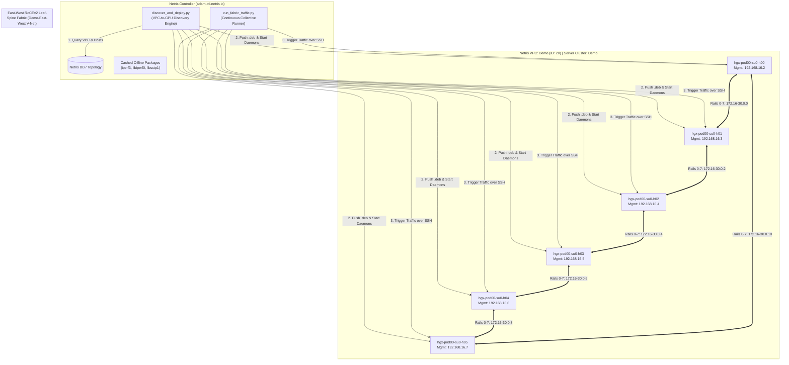
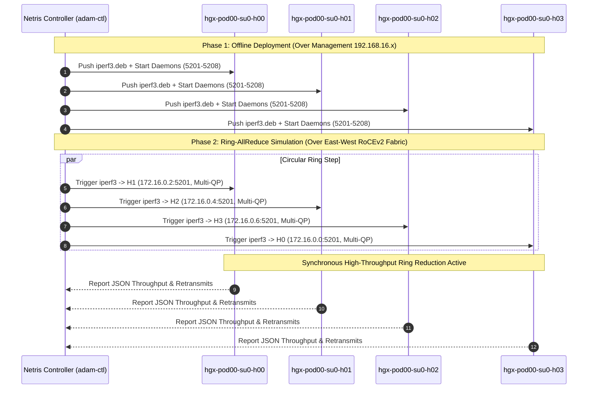

# Netris Controller VPC GPU Fabric Traffic Orchestrator

A production pre-sales automation suite executed directly from the **Netris Controller** (`adam-ctl.netris.io`). It dynamically interrogates Netris topology databases to map which HGX GPU servers belong to which **Netris VPC**, distributes a self-sustaining offline bare-metal `iperf3` package over management interfaces, and orchestrates continuous AI collective communication traffic (Ring-AllReduce, All-to-All MoE, Incast, Multi-Rail) across the high-speed backend RoCEv2 leaf-spine fabric.

---

## 1. Executive Summary & Architecture Value

When proving network fabric performance to NeoCloud customers, AI GigaFactory operators, and infrastructure architects:
- **Zero Internet Dependency on Compute Nodes:** High-security AI clusters and HGX GPU compute nodes typically have zero direct Internet access. All deployment must originate from the Netris Controller, which acts as the trusted bastion.
- **Bare-Metal Native Execution:** Eliminates container runtime overhead and virtualization translation layers. Runs directly on the host Linux kernel to reflect true hardware throughput and RoCEv2 link behavior.
- **VPC-Aware Multi-Tenancy:** Leverages Netris Controller database tables (`srv_cluster`, `srv_cluster_service_rel`, `rcircuit`, `vpc`) to automatically discover which GPU hosts belong to specific tenant VPCs.
- **Continuous Workload Cycling:** Continuously injects heavy collective traffic patterns to test sustained spine/leaf thermal loads, dynamic routing stability, and long-term fabric reliability.

---

## 2. Solution Topology & Deployment Architecture



---

## 3. How VPC-to-GPU Host Discovery Works

The discovery engine queries the internal Netris MariaDB relational schema:
```sql
SELECT 
    vpc.id AS vpc_id, 
    vpc.name AS vpc_name, 
    sc.id AS cluster_id, 
    sc.name AS cluster_name, 
    s.switch_id, 
    s.description AS server_hostname
FROM srv_cluster sc
JOIN srv_cluster_service_rel r_vnet ON (r_vnet.cluster_id = sc.id AND r_vnet.type = 'vnet')
JOIN vpc ON vpc.id = r_vnet.vpc_id
JOIN srv_cluster_service_rel r_hw ON (r_hw.cluster_id = sc.id AND r_hw.type = 'hw')
JOIN switch s ON s.switch_id = r_hw.cluster_svc_id
GROUP BY vpc.id, sc.id, s.switch_id;
```

This returns the exact list of bare-metal servers assigned to each tenant VPC. The tool then inspects each server's network configuration to map:
- **Management Interface (`ens4`):** `192.168.16.x` used for controller SSH orchestration.
- **Backend GPU Rails 0–7 (`ens5`–`ens12`):** `172.16.x.x` through `172.30.x.x` used for actual line-rate AI traffic injection.

---

## 4. Collective Traffic Simulation Sequence



---

## 5. Quick Start & Execution

### Option A: 1-Command Deploy & Run from Local Machine
Run `deploy.sh` to sync the toolkit to the Netris Controller, run discovery, deploy packages, and execute the benchmark:

```bash
cd "netris-controller-gpu-traffic-sim"
./deploy.sh
```

### Option B: Run Directly on Netris Controller (`adam-ctl.netris.io`)

```bash
# 1. SSH into the Netris Controller
ssh ubuntu@adam-ctl.netris.io

# 2. Navigate to toolkit directory
cd ~/netris-gpu-fabric-sim

# 3. Discover VPCs, inspect backend rails, and deploy offline packages
python3 discover_and_deploy.py

# 4. Run Ring-AllReduce benchmark (5 seconds, 4 parallel QPs per rail)
python3 run_fabric_traffic.py --pattern ring-allreduce --duration 5 --streams 4

# 5. Run Mixture of Experts (MoE) All-to-All full-mesh benchmark
python3 run_fabric_traffic.py --pattern all-to-all --duration 5 --streams 2

# 6. Run Incast / Storage Checkpointing benchmark against host 0
python3 run_fabric_traffic.py --pattern incast --duration 5 --streams 4

# 7. Run CONTINUOUS simulation loop in the BACKGROUND (disconnect-safe daemon)
# Capped at 400M aggregate bandwidth with ±20% equal-weight run-to-run variation
python3 run_fabric_traffic.py --pattern ring-allreduce --continuous --interval 5 --duration 4 --max-bandwidth 400M --daemon

# Check background daemon status
python3 run_fabric_traffic.py --status

# View live real-time traffic logs
tail -n 25 -f ~/netris-gpu-fabric-sim/traffic_runner.log

# Stop the background daemon
python3 run_fabric_traffic.py --stop
```

---

## 6. CLI Parameter Reference (`run_fabric_traffic.py`)

| Argument | Type | Default | Description |
|:---|:---|:---|:---|
| `--vpc` | string | `None` (auto-first) | Specific Netris VPC name to target |
| `--pattern` | choice | `ring-allreduce` | `ring-allreduce`, `all-to-all`, `incast`, `multi-rail`, or `all` |
| `--duration`, `-t` | int | `5` | Traffic duration in seconds per collective iteration |
| `--streams`, `-P` | int | `4` | Number of parallel Queue Pairs (TCP streams) per flow |
| `--tos` | int | `96` | IP Type-of-Service (96 = DSCP 24 / RoCEv2 Priority 3) |
| `--max-bandwidth`, `-B` | string | `None` | Overall cluster aggregate bandwidth ceiling (e.g. `500M`, `1G`, `2G`) |
| `--bitrate`, `-b` | string | `None` | Per-flow bandwidth rate cap (e.g. `50M`, `100M`) |
| `--bytes-limit`, `-n` | string | `None` | Data volume limit per flow instead of time (e.g. `100M`, `500M`) |
| `--continuous` | flag | `False` | Run continuously in an infinite or counted loop |
| `--interval` | int | `5` | Sleep seconds between continuous iterations (simulating compute epoch) |
| `--iterations` | int | `0` (infinite) | Stop after $N$ iterations when running in continuous mode |
| `--json-out` | path | `None` | Path to export accumulated benchmark history in JSON |
