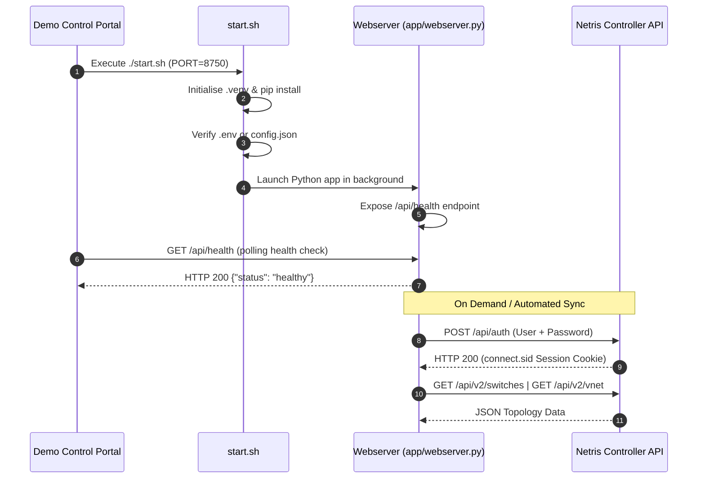

> **[WARNING] Demonstration Code Only**
> This repository contains demonstration code for architectural evaluation and technical pre-sales validation. It represents a **reference implementation pattern**, not an official Netris production release. Use at your own discretion.

# Netris Demo Integration Tool Template

A standardised blueprint for building independent, standalone integration tools that connect with the Netris Controller while remaining plug-and-play compatible with the central Netris Proof of Concept Demo Portal.

---

## 1. What This Is
This repository provides the canonical scaffolding for any new Netris ecosystem utility, monitoring exporter, IPAM bridge, or workload orchestrator.
- **Independent Execution:** Every project built from this template functions 100% autonomously via its self-contained startup lifecycle.
- **Demo Portal Contract:** Implements universal startup scripts (`./start.sh`), teardown scripts (`./stop.sh`), configuration sync formats, and automated health checks (`/api/health`).
- **Pre-Integrated Netris Client:** Includes a synchronous, cookie-authenticated Python client capable of communicating with `POST /api/auth`, querying inventory, reading topology, and synchronising state.

---

## 2. Under the Hood
*A step-by-step breakdown of how the integration executes:*



1. **Initialisation:** `./start.sh` creates an isolated `.venv`, installs packages defined in `requirements.txt`, and populates local `.env` from `.env.example`.
2. **Environment Discovery:** `app/config.py` loads runtime controller URLs, ports, and credentials from `.env` or `config.json`.
3. **Health Validation:** The webserver exposes an instant `/api/health` JSON check enabling the Demo Portal to monitor process state.
4. **Controller Communication:** `app/netris_client.py` captures session tokens and queries or mutates physical fabric resources.

---

## 3. Quickstart (Standalone Usage)

### Prerequisites
- Python 3.10+ (or Python 3.11–3.14)
- Target Netris Controller access credentials

### Installation & Execution
1. **Clone your repository:**
   ```bash
   git clone https://github.com/iamjarvs/your-new-tool.git
   cd your-new-tool
   ```

2. **Configure environment:**
   ```bash
   cp .env.example .env
   # Populate NETRIS_URL, NETRIS_USERNAME, and NETRIS_PASSWORD
   ```

3. **Start the service:**
   ```bash
   ./start.sh
   ```
   Open your browser at `http://localhost:8750`.

4. **Stop the service:**
   ```bash
   ./stop.sh
   ```

---

## 4. Repository Structure (Standard Contract)

To maintain uniformity across all remote integrations, this repository adheres to the following directory layout:

```text
├── start.sh              # Universal executable entrypoint (creates .venv, starts server)
├── stop.sh               # Universal teardown script (graceful termination)
├── .env.example          # Environment variable template
├── config.example.json   # Optional JSON configuration template
├── requirements.txt      # Python dependencies
├── .gitignore            # Ignores .venv, .env, credentials, and logs
├── README.md             # Standardised documentation
└── app/                  # Application package
    ├── __init__.py
    ├── config.py         # Root-aware configuration loader
    ├── netris_client.py  # Canonical Netris Controller API client
    └── webserver.py      # Flask/FastAPI service exposing /api/health
```

---

## 5. Integrating with the Demo Control Portal

To expose your tool inside the central Netris Demo Portal as a remote installable module:

1. **Register in `demo-portal/tools.yaml`:**
   ```yaml
   - id: "your-tool-id"
     name: "Your Tool Name"
     type: "git"
     url: "https://github.com/your-username/your-new-tool.git"
     path: "./managed-tools/your-tool-id"
     description: "One line summary of functionality."
     optional: true
   ```

2. **Register metadata in `demo-portal/app/manager.py`:**
   Add your entry into `TOOLS_METADATA` specifying `port`, `popout_url`, and `health_endpoint: "http://localhost:<PORT>/api/health"`.

3. **Enable configuration synchronisation in `demo-portal/app/config_sync.py`:**
   Add your directory to `sync_global_to_all_tools` and `TOOL_CONFIG_REGISTRY` so shared controller credentials automatically sync upon launch.
