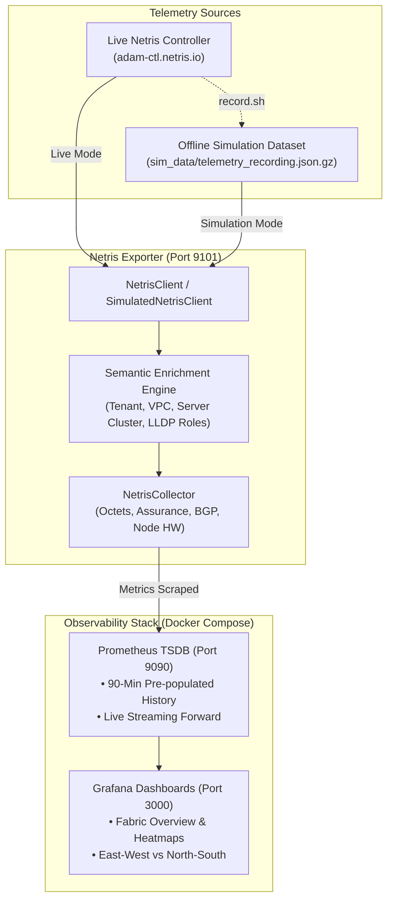

# Netris Prometheus Exporter & Observability Stack

A standalone Prometheus Exporter and pre-configured Grafana Observability stack for the **Netris Controller**.

Unlike generic SNMP pollers or standard node exporters, this integration features a **Semantic Data Enrichment Engine** that correlates low-level switch and port telemetry with high-level Netris constructs: **Tenants, VPCs, V-Nets, Server Clusters, and LLDP Physical Cabling Intent**.

It also features a 100% offline **Simulation Mode & Telemetry Recorder** with **Instant 90-Minute Historical TSDB Pre-population**, allowing you to start the stack and immediately present full, rich Grafana dashboards without waiting for streaming metrics to accumulate.

---

## 1. Overview & Architectural Flow



### Key Capabilities
- **Instant Demo Readiness (90-Minute Pre-population)**: When simulation mode starts, Prometheus TSDB is automatically backfilled with 90 minutes of historical telemetry (1.4+ million samples). Every Grafana panel is 100% populated with continuous historical lines from the very first second.
- **Semantic Port Enrichment**: Every switch port counter is automatically enriched with its connected device (`remote_device`), remote port (`remote_port`), remote type (`server` / `switch`), port role (`server_facing` / `fabric_interconnect`), tenant (`Admin`), and assigned VPC & Server Cluster (`Demo`).
- **East-West & North-South Separation**: Segregates server-facing cluster access throughput from spine/leaf fabric transit in dedicated Grafana panels and metrics.
- **Continuous Active Assurance**: Exposes real-time pass/fail states for Netris's 1,300+ automated background verification checks, including LLDP cabling validation, BGP underlay consistency, and optical transceiver degradation.
- **BGP & Multi-Cloud Peering**: Tracks session states, prefixes received, and uptime across underlay fabric links and external edge BGP neighbors terminating on Netris SoftGates.
- **Node Hardware Assurance**: CPU load averages (1m, 5m, 15m), RAM % used, disk % used, fan tray RPM status, and dual-PSU redundancy.
- **Offline Simulation Replay**: Replay recorded fabric metrics continuously without live controller access.

---

## 2. Quickstart: One-Click Launcher (`start.sh`)

The root directory includes an automated launcher script `start.sh`:

### Running in Simulation Mode (Instant 90-Minute Demo Mode)
```bash
./start.sh --sim
```
* **Zero Credentials Required**: Does not require `netris.var` or access to `adam-ctl.netris.io`.
* **Instant Historical Data**: Automatically synthesizes and injects **90 minutes of historical TSDB data** into Prometheus in ~15 seconds using `promtool`.
* **Continuous Replay**: Replays frames in an infinite ring buffer with realistic micro-jitter (±1–3%) so Grafana streams continuous live updates after the historical data.

#### Customizing Historical Pre-fill Duration
```bash
# Pre-populate 120 minutes of history instead of 90:
./start.sh --sim --backfill 120

# Launch simulation mode without historical backfill:
./start.sh --sim --no-backfill
```

### Running in Live Mode (Active Controller)
```bash
./start.sh --live
```
* Connects to the Netris Controller specified in `netris.var`.
* Enriches and streams live switch octets and Active Assurance health checks.

### Stopping the Stack
```bash
./stop.sh
```

---

## 3. Standalone Historical Backfill Tool (`backfill.sh`)

You can artificially backfill or refresh Prometheus TSDB history at any time without restarting the entire stack:

```bash
# Syntax: ./backfill.sh [minutes] [step_in_seconds]
./backfill.sh 90 60
```

### How the Backfill Engine Works
1. Reads the recorded snapshot (`sim_data/telemetry_recording.json`).
2. Iterates backward in time from `now` to `now - N minutes` at the specified step resolution (e.g. 60 seconds).
3. Evaluates all 17,000+ metric series with realistic micro-jitter (traffic variance, CPU loads, memory utilization).
4. Emits valid OpenMetrics format grouped by metric family.
5. Invokes `promtool tsdb create-blocks-from openmetrics` inside the Prometheus container to compile raw TSDB blocks directly into `./prometheus/data`.
6. Prometheus serves historical range queries over this data instantly upon mounting.

---

## 4. Telemetry Recording Engine (`record.sh`)

You can create or refresh telemetry snapshot recordings at any time while connected to a live Netris Controller:

```bash
# Syntax: ./record.sh [duration_in_seconds] [interval_in_seconds]
./record.sh 60 15
```

Or using the launcher shortcut:
```bash
./start.sh --record 60 15
```

### What the Recorder Captures:
1. **Complete Topological Snapshot**:
   - Sites, Managed Hardware, Ports, and Cabling Links
   - VPCs, V-Nets, Tenants, and IPAM Subnets
   - Server Clusters and GPU Pod Mappings
2. **Dynamic Streaming Frames**:
   - Continuous Active Assurance health checks
   - Agent heartbeats & hardware alarms
   - Streaming Graphite interface octets (receive & transmit) across all switches and SoftGates
3. **Packaging**:
   - Compiles everything into `sim_data/telemetry_recording.json`.

---

## 5. Accessing Services

Once started via `./start.sh`:

- **Grafana Dashboards**: `http://localhost:3000` (User: `admin` / Password: `admin`)
  - *Default Home Dashboard:* **Netris Fabric Observability**
  - Features 28 pre-built panels branded with Netris identity (Dark Theme `#0c0d0e`, Netris Teal `#00ffff`, Emerald `#10b981`, Coral `#f43f5e`).
  - Pre-configured to view `Last 1 hour` (or `Last 90 minutes`) with full historical lines immediately upon opening.
- **Prometheus UI**: `http://localhost:9090`
- **Raw Exporter Metrics**: `http://localhost:9101/metrics`

---

## 6. Configuration Reference

### Connection File (`netris.var`)
*Used exclusively in Live Mode. Optional in Simulation Mode.*
```bash
NETRIS_URL="https://adam-ctl.netris.io"
NETRIS_USERNAME="netris"
NETRIS_PASSWORD="your-password"
NETRIS_AUTH_SCHEME_ID=1
NETRIS_VERIFY_SSL=false
```

### Runtime Parameters (`config.env`)
```bash
# Ports
EXPORTER_PORT=9101
PROMETHEUS_PORT=9090
GRAFANA_PORT=3000

# Exporter Behavior
METADATA_REFRESH_INTERVAL=300
SCRAPE_TIMEOUT=20
LOG_LEVEL=INFO
ENABLE_STREAMING_TRAFFIC=true
STREAMING_TRAFFIC_ACTIVE_ONLY=true

# Simulation Mode (can also be toggled with ./start.sh --sim)
SIMULATION_MODE=false
SIM_DATA_FILE=sim_data/telemetry_recording.json
```

---

## 7. Metric Reference & Enriched Labels

| Metric Name | Type | Description | Key Enriched Labels |
| :--- | :--- | :--- | :--- |
| `netris_up` | Gauge | Controller reachable / simulation active | None |
| `netris_device_info` | Gauge | Managed switches, softgates, servers | `site`, `device_name`, `device_role`, `fabric_type`, `nos` |
| `netris_device_status` | Gauge | Device operational state (1=OK, 0=Err) | `site`, `device_name`, `device_role`, `fabric_type` |
| `netris_agent_heartbeat` | Gauge | Switch/SoftGate agent heartbeat | `site`, `device_name`, `device_role`, `fabric_type` |
| `netris_port_status` | Gauge | Physical port state (1=UP, 0=DOWN) | `device_name`, `port`, `port_role`, `remote_device`, `remote_port`, `server_cluster`, `vpc`, `tenant` |
| `netris_port_utilization_rx_percent` | Gauge | RX bandwidth utilization % | Same as `netris_port_status` |
| `netris_port_utilization_tx_percent` | Gauge | TX bandwidth utilization % | Same as `netris_port_status` |
| `netris_port_error_status` | Gauge | Port errors / drops detected | `device_name`, `port`, `remote_device`, `port_role` |
| `netris_topology_wiring_valid` | Gauge | Cabling validation (1=Valid, 0=Miswired) | `site`, `device_name`, `port`, `message` |
| `netris_bgp_session_state` | Gauge | BGP session state (1=Established, 0=Down)| `site`, `device_name`, `port`, `bgp_type`, `peer_info` |
| `netris_interface_receive_bits_per_second` | Gauge | Live receive throughput in bits/sec | `site`, `device_name`, `device_role`, `fabric_type`, `port`, `port_role`, `remote_device`, `remote_port`, `server_cluster`, `vpc`, `tenant` |
| `netris_interface_transmit_bits_per_second` | Gauge | Live transmit throughput in bits/sec | Same as receive bits/sec |
| `netris_interface_receive_bytes_per_second` | Gauge | Live receive throughput in bytes/sec | Same as receive bits/sec |
| `netris_interface_transmit_bytes_per_second` | Gauge | Live transmit throughput in bytes/sec | Same as receive bits/sec |
| `netris_node_load_1m` | Gauge | CPU 1m load average | `site`, `device_name`, `device_role` |
| `netris_node_load_5m` | Gauge | CPU 5m load average | `site`, `device_name`, `device_role` |
| `netris_node_load_15m` | Gauge | CPU 15m load average | `site`, `device_name`, `device_role` |
| `netris_node_memory_used_percent` | Gauge | RAM utilization % | `site`, `device_name`, `device_role` |
| `netris_node_component_health` | Gauge | Fans, PSUs, Temperature sensors (1=OK) | `site`, `device_name`, `device_role`, `check_name`, `detail` |
| `netris_ebgp_session_state` | Gauge | External transit BGP state | `site`, `neighbor_name`, `peer_ip`, `peer_asn`, `softgate`, `vpc` |
| `netris_ebgp_prefixes_received` | Gauge | Prefixes received from BGP peer | `site`, `neighbor_name`, `peer_ip`, `peer_asn`, `softgate`, `vpc` |
| `netris_ipam_subnet_info` | Gauge | IPAM subnet configurations | `site`, `subnet_prefix`, `purpose`, `vpc`, `tenant` |

---

## 8. Pre-Sales & Demo Talk Track

When demonstrating this integration to prospective customers:

1. **Instant, Production-Grade Demo Environment:**
   > *"Notice how the dashboard doesn't start with blank or flat charts. With one command (`./start.sh --sim`), we synthesize 90 minutes of high-resolution historical telemetry across all 86 devices, switches, GPU servers, and transits, with real-time streaming taking over immediately."*
2. **The Context Gap in Legacy Monitoring:**
   > *"If an SRE looks at a traditional SNMP dashboard and sees `swp1s0 on 10.253.128.11 has drops`, they have to spend 20 minutes tracing spreadsheets. With our enriched Prometheus exporter, Grafana immediately shows that `swp1s0` is connected to GPU server `hgx-pod00-su0-h09` under the `slurm-job-1002` cluster."*
3. **Proactive Cable Assurance:**
   > *"Point out the LLDP Cabling Validation panel. Netris Continuous Active Assurance detects miswired cables and bad transceivers immediately upon physical connection, preventing packet drops from failing multi-day training runs."*
