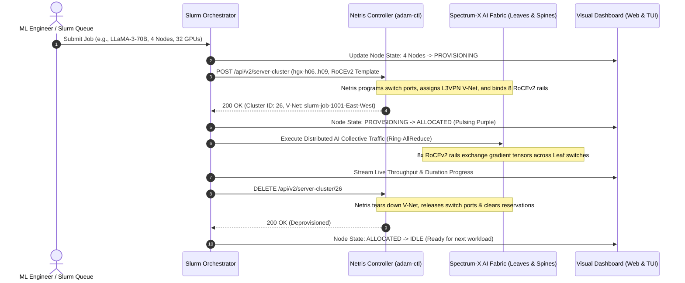
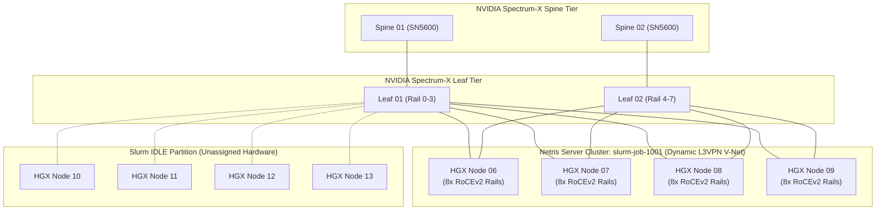

# Netris Slurm Workload Manager Integration: Dynamic GPU AI Fabric Orchestration

---

## 1. Executive Overview & Business Value

Modern enterprise AI clusters powered by NVIDIA HGX systems (H100, H200, B200) face severe bottlenecks when networks are provisioned statically. Legacy network operations force high-performance computing (HPC) teams into one of two compromises:
1. **Static, Over-Provisioned Fabrics**: Fragile flat networks with no isolation between concurrent multi-node training runs, risking noisy-neighbor collisions and rogue gradient storms.
2. **Manual Ticket-Driven Changes**: Hours or days of delay between jobs waiting for network engineers to reconfigure switch VLANs, ACLs, and routing.

**Netris Cloud Networking** transforms physical Ethernet fabrics into an agile, programmatic cloud primitive. Through this integration, **Slurm Workload Manager** dynamically orchestrates the network lifecycle in lockstep with compute scheduling:
- **Instant Tenant Isolation**: When Slurm allocates a subset of HGX GPU nodes for an AI training run, Netris automatically constructs an ephemeral, dedicated **Netris Server Cluster** and an isolated **East-West RoCEv2 L3VPN V-Net** (~2 minutes provisioning phase as switch agents configure BGP EVPN and RoCEv2 QoS).
- **Realistic Enterprise Workloads**: Jobs execute distributed training for a **minimum of 7 minutes (420s)** up to 10+ minutes, matching realistic HPC training runs with 8-rail RoCEv2 traffic.
- **Automated Zero-Touch Teardown**: Upon job completion, Netris dismantles the Server Cluster, clears switch port reservations, and withdraws routes (~2 minutes teardown phase), returning the nodes to the idle scheduling partition.
- **Enterprise Multi-Tenancy & ROI**: Maximizes costly GPU utilization across heterogeneous workloads (LLaMA-3 pretraining, DeepSeek-MoE alignment, Mixtral fine-tuning) without risking network interference.

---

## 2. Architecture & Integration Flow

The integration bridges Slurm scheduling decisions directly with the **Netris Controller REST API** (`/api/v2/server-cluster`):



---

## 3. Network Fabric Topology & Deliverable Components



### Deliverable Components

All deliverables are self-contained within this dedicated subfolder:

| File | Purpose |
|---|---|
| `netris_api.py` | Python client for Netris Controller REST API (`/api/auth`, `/api/v2/server-cluster`, templates, and server inventory). |
| `slurm_orchestrator.py` | Slurm Workload Manager simulation engine: node pool tracking, continuous autopilot, dynamic job scheduling, and Netris lifecycle orchestration. |
| `web_dashboard.py` | Real-time Web Dashboard HTTP server and REST API with zero external Python dependencies. |
| `static/index.html` | Dark-mode Netris-themed interface with live GPU node matrix, active Slurm queue, and Netris Controller sync. |
| `static/style.css` | Custom styling with pulsing animations for active network flows and responsive card layouts. |
| `static/app.js` | Frontend asynchronous state machine and interactive job submission modals. |
| `terminal_tui.py` | High-visibility ANSI console TUI dashboard for direct SSH sessions. |
| `run_simulation.py` | Unified CLI entry point for launching the simulator and web UI. |
| `deploy_controller.sh` | Remote deployment and synchronization script for `adam-ctl.netris.io`. |

---

## 4. Quickstart Guide & Execution Modes

### Mode 1: Launch in Offline Simulation & Telemetry Replay Mode (Zero Network Dependency)

Ideal for customer briefings, airplane/offline work, or self-contained demonstrations:
- Replays full Slurm scheduling lifecycles in a **nonstop continuous loop**.
- Emulates 8-Rail RoCEv2 telemetry (45-50 Gbps per rail, 20% traffic flux, PFC pause frames, CNP packets, RTT latency, 0% drops).
- No internet access or connection to `adam-ctl.netris.io` required!

```bash
cd netris-slurm-cluster-sim

# Launch offline simulated replay mode
python3 run_simulation.py --sim-mode --port 8088

# Optional: Speed up time by 10x or 60x for faster demo pacing
python3 run_simulation.py --sim-mode --port 8088 --speedup 10
```

Open your browser to:
👉 **`http://localhost:8088/`**

### Mode 2: Launch with Live Netris Controller (adam-ctl.netris.io)

The simulator can also communicate directly with the live Netris Controller over its public REST API:

```bash
python3 run_simulation.py --port 8088
```
*(Note: If the live controller is unreachable or credentials fail, the simulator automatically falls back to offline simulation mode).*

### Mode 3: Launch with Live Terminal TUI

To observe the ASCII GPU node matrix and event stream directly inside your terminal window while the web server runs in the background:

```bash
python3 run_simulation.py --port 8088 --terminal
```

### Mode 4: Deploy and Run on the Netris Controller Directly

To run the simulation directly on `ubuntu@adam-ctl.netris.io`:

```bash
# Deploy code to adam-ctl
./deploy_controller.sh

# SSH into controller and launch
ssh ubuntu@adam-ctl.netris.io
cd ~/netris-slurm-sim
python3 run_simulation.py --terminal-only
```

---

## 5. Key Features & Demo Scenarios

1. **Live Synchronized Netris Controller View**:
   - The dashboard queries `GET /api/v2/server-cluster` directly from the live Netris Controller every 2 seconds.
   - You can cross-check in the official Netris Web UI at `https://adam-ctl.netris.io/net/server-cluster` to watch clusters appear and disappear in real time.
2. **Interactive Job Submission**:
   - Click **"Submit Job"** to launch custom AI workloads (choose model type, 2/4/8 nodes, custom duration, and collective pattern).
3. **Continuous Autopilot Mode**:
   - Automatically generates realistic bursty AI workloads (LLaMA-3-70B, DeepSeek-MoE, Mixtral-8x7B, SDXL Diffusion, AlphaFold-3) whenever sufficient idle nodes exist.
   - Demonstrates cluster churn, varying job durations, and non-blocking scheduling.
4. **Emergency Teardown & Reset**:
   - One-click button to cleanly dismantle all active Server Clusters and restore the entire HGX partition back to `IDLE`.

---

## 6. Configuration & CLI Options

CLI parameters for `run_simulation.py`:

| Parameter | Default | Description |
|---|---|---|
| `--sim-mode` | `False` | Run in 100% offline simulation mode (bypasses Netris Controller network reachability). |
| `--port` | `8088` | Web dashboard HTTP listening port. |
| `--host` | `0.0.0.0` | Web dashboard host bind address. |
| `--speedup` | `1` | Time acceleration multiplier (e.g. `10` or `60`) for rapid demonstrations. |
| `--terminal` | `False` | Run interactive ANSI TUI inside terminal alongside background web dashboard. |
| `--terminal-only` | `False` | Run console TUI only (no web server). |

---

## 7. Verification & Troubleshooting

- **Controller Connectivity**: When running without `--sim-mode`, the orchestrator checks `adam-ctl.netris.io`. If credentials or network fails, it automatically falls back to offline simulation mode without crashing.
- **Web UI Access**: Visit `http://localhost:8088/`. If port 8088 is in use, supply `--port 8089`.
- **Resetting State**: Click the red **Emergency Reset** button in the web dashboard or restart `run_simulation.py` to reset the cluster to 100% idle state.
