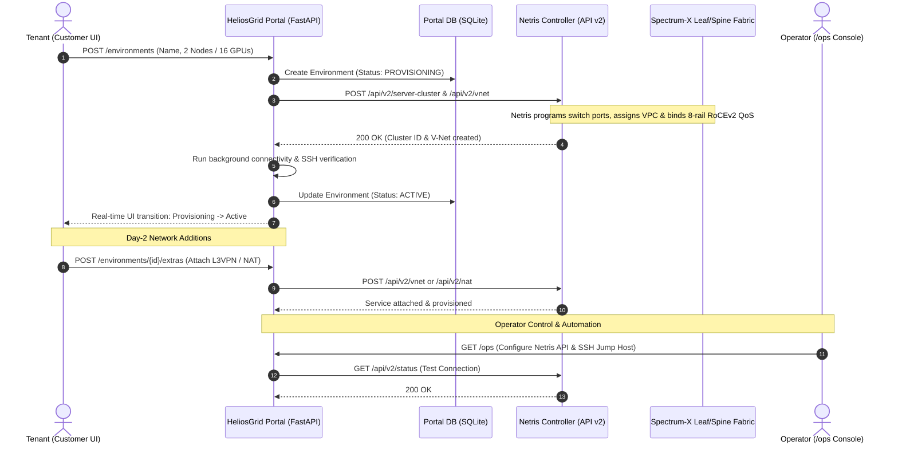

# HeliosGrid Provider Portal: Multi-Tenant AI Cloud & Netris VPC Self-Service

A turnkey, production-grade demonstration portal showcasing how NeoCloud operators and enterprise AI infrastructure teams offer **AWS-like self-service cloud provisioning for bare-metal GPU clusters** powered by **Netris Cloud Networking**.

Built with a modern **FastAPI** backend, SQLite state store, and a responsive **React 18** frontend, HeliosGrid enables end customers to order isolated GPU clusters with automated Netris VPCs, V-Nets, and RoCEv2 fabrics, while providing operators with an administrative control plane (`/ops`).

---

## 1. Overview & Business Value

Building and operating multi-tenant GPU clouds presents a fundamental challenge: GPU servers represent massive capital investments that must be securely partitioned among multiple tenants without manual network re-cabling or fragile VLAN sprawl.

### Customer Pain Points Addressed
- **Slow Tenant Onboarding**: Traditional bare-metal provisioning requires hours or days of network team coordination to configure leaf/spine switch ports, BGP underlays, and EVPN overlays.
- **Noisy Neighbors & Security Risks**: Shared flat networks risk traffic interference between AI training workloads (gradient storms) and expose proprietary model weights across tenant boundaries.
- **Complex Day-2 Network Operations**: Provisioning secondary services (L2/L3 site-to-site VPNs, external BGP peering, public NAT egress) requires bespoke network tickets.

### Netris Value Proposition & ROI
- **Sub-3-Minute Self-Service Delivery**: Customers provision dedicated GPU environments in clicks; Netris automatically configures the underlying switch fabric, BGP EVPN, and RoCEv2 QoS.
- **Hard Multi-Tenancy by Default**: Every environment is isolated in its own **Netris VPC** and dedicated **East-West RoCEv2 L3VPN V-Net**.
- **Automated Day-2 Services**: Tenants dynamically attach external L2VPNs, NAT gateways, and BGP peering sessions directly from the UI.
- **Operator Observability & Credential Vault**: Built-in operator portal (`/ops`) provides live Netris controller connectivity testing and automated device credential distribution for compute workloads.

---

## 2. Architecture & How It Works



### Core Components
- **Customer Self-Service Interface (`/`)**: React-based portal where tenants view GPU capacity, launch environments, monitor provisioning progress, run server connectivity tests, and attach network services.
- **Operator Administrative Console (`/ops`)**: Operator console for configuring Netris controller API endpoints, testing credentials, managing SSH jump-host profiles, and inspecting device credentials.
- **Provisioning Orchestrator (`app/provisioning/`)**: State machine handling asynchronous provisioning, background health polling, connectivity checks, and clean zero-touch teardown.
- **Netris API Client (`app/netris/`)**: Typed, resilient client for the Netris Controller v2 REST API managing Server Clusters, V-Nets, and NAT services.
- **Static Distribution (`static/`)**: Pre-compiled production React distribution ready to serve immediately without Node.js runtime overhead.

---

## 3. Prerequisites & Requirements

- **Python**: Python 3.10 or higher.
- **Operating System**: Linux or macOS.
- **Optional**: Node.js 18+ (only required if modifying the React source code under `frontend/`; the pre-built UI in `static/` runs immediately via FastAPI).
- **Netris Access**: A running Netris Controller (live or simulated) with API credentials.

---

## 4. Quickstart / How to Use

### Step 1: Clone & Enter Directory
```bash
cd provider-portal
```

### Step 2: Configure Environment Variables
Copy the template configuration and generate security keys:
```bash
cp .env.example .env

# Generate Fernet encryption key and session secret
python3 -c "from cryptography.fernet import Fernet; print('FERNET_KEY=' + Fernet.generate_key().decode())"
python3 -c "import secrets; print('SESSION_SECRET=' + secrets.token_hex(32))"
```
Edit `.env` to insert the generated `FERNET_KEY` and `SESSION_SECRET` values.

### Step 3: Install Dependencies
```bash
python3 -m venv .venv
source .venv/bin/activate
pip install -r requirements.txt
```

### Step 4: Launch the Portal
```bash
uvicorn app.main:app --host 0.0.0.0 --port 8000 --reload
```

### Step 5: Access the Interfaces
- **Customer Portal**: [http://localhost:8000](http://localhost:8000)
  - Default Username: `hackmecorp`
  - Default Password: `change-me` (as configured in `.env`)
- **Operator Console**: [http://localhost:8000/ops](http://localhost:8000/ops)
  - Default Operator: `adam`
  - Default Password: `change-me` (as configured in `.env`)

---

## 5. Configuration & Environment Variables

Key parameters defined in `.env`:

| Variable | Required | Default | Description |
|---|---|---|---|
| `CUSTOMER_USERNAME` | Yes | `hackmecorp` | Seed username for the tenant login. |
| `CUSTOMER_PASSWORD` | Yes | `change-me` | Seed password for the tenant login. |
| `OPERATOR_USERNAME` | Yes | `adam` | Administrative operator username. |
| `OPERATOR_PASSWORD` | Yes | `change-me` | Administrative operator password. |
| `FERNET_KEY` | Yes | *None* | 32-byte Fernet key used to encrypt stored Netris API credentials in SQLite. |
| `SESSION_SECRET` | Yes | *None* | Secret key used to sign tenant session cookies. |
| `PORT` | No | `8000` | Port for the FastAPI HTTP server. |
| `DB_PATH` | No | `data/portal.db` | Path to SQLite database file. |

*Note: Once booted, Netris Controller URL, credentials, and SSH jump-host configurations are managed securely directly in the `/ops` settings UI and stored encrypted in the database.*

---

## 6. Demo Scenarios & Walkthrough

### Scenario A: Executive Self-Service Storyline
1. **Login as Tenant**: Open `http://localhost:8000`, log in as `hackmecorp`.
2. **Review Dashboard**: Show available GPU capacity (e.g. 16 GPUs / 2 HGX Nodes available).
3. **Order New Cluster**: Click **"New Environment"**, name it `DeepSeek-Training-Run`, select 2 Nodes (16 GPUs), and click **"Deploy Environment"**.
4. **Watch Netris Automation**: Highlight the animated provisioning stepper. Point out that while the tenant sees a simple cloud progress bar, Netris is dynamically allocating switch ports, creating an isolated L3VPN V-Net, and configuring 8-rail RoCEv2 QoS in the background.
5. **Inspect Active Environment**: Once active, review the assigned server IPs, management endpoints, and cluster telemetry.

### Scenario B: Day-2 Network Expansion
1. Navigate to the newly provisioned environment detail page.
2. Under **"Add Network Services"**, attach an **L3VPN** or **Public NAT Gateway**.
3. Emphasize that physical switch infrastructure is being dynamically altered via Netris APIs without requiring a network maintenance window.

### Scenario C: Operator Visibility & Credential Federation
1. Navigate to `http://localhost:8000/ops`.
2. Authenticate as the operator.
3. Demonstrate live controller connectivity testing and explain how compute automation tools (such as Meridian ChatSim or Slurm) query `/ops/api/device-credentials` to securely resolve host contexts.

---

## 7. Verification & Troubleshooting

### Health & Diagnostic Endpoints
- **Operator Settings API**: `GET /ops/api/settings`
- **Device Credentials API**: `GET /ops/api/device-credentials` (Requires operator basic auth)

### Common Troubleshooting
- **Frontend not loading**: Ensure `static/index.html` exists. If modifying React code, run `npm install && npm run build` inside `frontend/` to generate fresh assets into `static/`.
- **Netris API Connection Failures**: Check Netris Controller URL in `/ops`. Ensure Netris Controller is reachable and SSL verification settings match the deployment environment.
- **Database Reset**: To reset demo state to clean seeds, stop the server, delete `data/portal.db`, and restart.
