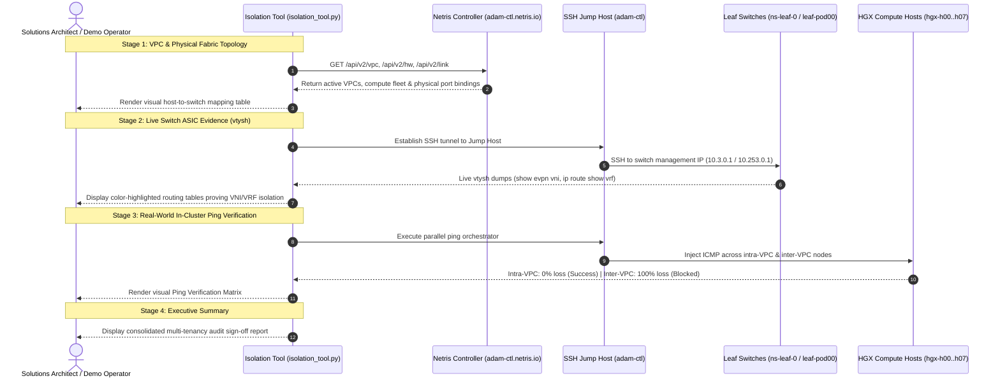

# Netris Switch & Fabric Isolation CLI Suite

A production-grade, interactive CLI utility engineered for **pre-sales demonstrations, customer security reviews, and engineering validation** of multi-tenant isolation across **North-South (EVPN/VXLAN)** and **East-West (Pure VRF)** fabrics on live Netris Controller infrastructure.

Using an interactive terminal UI (powered by `rich` and `questionary`), this suite steps through discovery, live leaf-switch table inspection via `vtysh`, and cross-VPC ping traffic testing to deliver indisputable proof that tenant boundaries are strictly enforced in hardware ASICs.

---

## 1. Overview & Business Value

Enterprise security officers, NeoCloud tenants, and infrastructure leaders frequently ask:
> *"How do we know our AI model weights and high-bandwidth RoCEv2 traffic are completely isolated from other tenants in the same physical leaf/spine fabric?"*

Showing high-level UI checkboxes is often insufficient for security audits. Customers require **indisputable ASIC-level evidence**:
- **North-South Multi-Tenancy Proof**: Direct proof of EVPN VXLAN VNI separation on out-of-band management leaf switches.
- **East-West RoCEv2 Isolation Proof**: Inspection of kernel VRF routing tables on backend GPU leaf switches proving non-overlapping Forwarding Information Bases (FIBs).
- **Live In-Cluster Traffic Verification**: Actual synthetic ping injections confirming that cross-tenant traffic is blocked with 100% packet loss, while intra-tenant compute nodes communicate with microsecond latency.

---

## 2. Architecture & 4-Stage Verification Workflow



---

## 3. Prerequisites & Requirements

- **Python**: Python 3.10 or higher.
- **Dependencies**: `questionary`, `rich`, `paramiko`, `asyncssh`, `requests` (installed automatically by `run.sh`).
- **Network Reachability**:
  - Outbound access to Netris Controller API (e.g. `https://adam-ctl.netris.io`).
  - SSH access to the jump host (e.g. `adam-ctl.netris.io:22`, `ubuntu`).
  - Switch SSH private key (`id_rsa`) present on the jump host.

---

## 4. Quickstart / How to Run

### Option A: Launch from the Demo Control Portal (Browser)
1. Open the **Demo Command Center** at [http://localhost:8800](http://localhost:8800).
2. Locate the **Switch & Fabric Isolation Suite** card.
3. Click **"Launch CLI"** to interact with the full Questionary menu inside the in-browser terminal, or click **"Open in macOS Terminal ↗"** to launch it in a native Terminal window!

### Option B: Run Standalone from Terminal
```bash
cd switch-isolation-cli
./run.sh
```
*(On first execution, `run.sh` automatically provisions a dedicated `.venv` and installs required packages).*

---

## 5. Configuration & Shared Credential Sync

Configuration is managed via [`config.json`](file:///Users/adam/.gemini/antigravity/scratch/netris-demo-tools/switch-isolation-cli/config.json):

```json
{
  "netris_url": "https://adam-ctl.netris.io",
  "netris_username": "netris",
  "netris_password": "your-password",
  "ssh_jump_host": "adam-ctl.netris.io",
  "ssh_jump_port": 22,
  "ssh_jump_user": "ubuntu",
  "ssh_jump_password": "your-password",
  "ssh_switch_user": "cumulus",
  "ssh_switch_key_path": "/home/ubuntu/.ssh/id_rsa"
}
```

- **In the Portal**: Navigate to **"Shared Controller Settings"** to update credentials globally, or use **"Tool Configurations"** to edit `config.json` directly.
- **In the CLI**: Select menu option `4. Configure Netris & SSH Settings` to view and update credentials interactively.

---

## 6. Demo Scenarios & Customer Walkthrough

1. **Stage 1 — Topology Resolution**:
   - Select the customer's VPC (e.g. `VPC-20` / `Demo`).
   - The tool resolves which HGX GPU servers belong to this VPC and precisely maps every host interface (`eth1`, `eth5`, etc.) to its Top-of-Rack leaf switch and ASIC port.
2. **Stage 2 — Switch Hardware Tables**:
   - Direct connection into `ns-leaf-0` and `leaf-pod00-su0-r0`.
   - Point out highlighted dedicated VXLAN VNIs and strictly isolated VRF routing entries.
3. **Stage 3 — Ping Matrix Verification**:
   - Executes live pings from `hgx-pod00-su0-h00` to sibling nodes in the same VPC (proving 100% connectivity and low latency).
   - Executes pings from `hgx-pod00-su0-h00` to nodes in another tenant's VPC (proving 100% packet drop and complete tenant isolation).

---

## 7. Verification & Troubleshooting

- **Testing Configuration**: Run `./run.sh` and select option `4` to test Netris API and jump host reachability.
- **SSH Key Permissions**: Ensure `/home/ubuntu/.ssh/id_rsa` on the jump host has `0600` permissions.
- **Portal Terminal Integration**: If using the web terminal, ensure WebSocket traffic is allowed on port `8800`.
